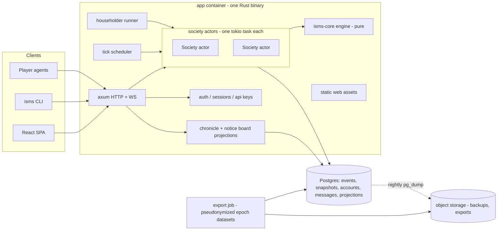
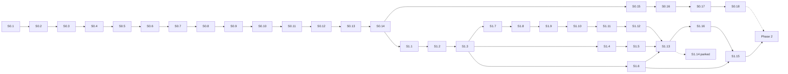

# Technical Design Document: *Isms* (working title)

*Engineering plan for the web-based multiplayer economic simulation described in the GDD.*

**Status:** TDD v0.1 — first full draft, ready for coding-agent handoff · **Author:** Chris (drafted with Claude) · **Date:** Sept 2026
**Upstream:** [GDD v0.1](isms-gdd.md) · [Concept Doc](economic-systems-game-concept.md) · **Downstream:** the repository itself (`docs/` mirrors this doc; ADRs record deviations)

**How to read this doc.** The GDD says *what* the game is; this doc says *how it is built* and *in what order*. Sections 1–17 are the design. Section 18 is the work breakdown: a sequence of self-contained work sessions sized for a coding agent, each with a goal, a reading list, a scope fence, and a done-gate that must be green before the next session starts. A coding agent should read §0 (conventions), then the session card it has been assigned, then only the TDD/GDD sections that card points to.

Every [Proposed] decision in GDD v0.1 is treated here as **accepted**. Where this doc has to make an engineering choice the GDD left open, it is tagged **[TDD decision]** and listed in §16 so the choice can be overturned in one place. Constants are quoted from GDD Appendix A; the handful of new constants this doc introduces are tagged **[new tunable]** and must live in preset config, never in code.

---

## 0. Conventions for the coding agent

These are the rules every work session operates under. They are restated in the repo's `CLAUDE.md` (Appendix D) so the agent sees them without opening this doc.

**The engine is pure, deterministic, and event-sourced.** `isms-core` has no I/O, no async, no clock, no randomness except a seeded RNG passed in. State changes only by applying events. A command produces events or a rejection; a tick produces events. The same events folded onto the same starting state must produce a byte-identical state, in any process, on any machine. Every test in the engine relies on this and so does every research export.

**Constants live in config.** Anything in GDD Appendix A or tagged [new tunable] lives in `presets/*.toml` and is loaded into a `Params` struct. A literal number in engine code that could plausibly be tuned is a defect.

**Constitution gates capability; policy moves parameters.** The `Constitution` (eight axes, GDD §5) is immutable for a society's epoch. It determines which commands, contract types, and screens exist. `Policy` is mutable by the society's own governance within the constitution. Nothing outside the engine's command path can touch either.

**The web client is one client of the public API.** No endpoint exists for the UI that an API-key holder can't also call. If a screen needs data, the API grows a query; if it needs an action, the API grows a command. `client_kind` is stamped on every command.

**Every number is explainable.** Any value a player sees that was produced by a rule carries an `Explain` payload (§5.6): rule id, named inputs, and the formula. The UI renders these; tests assert their presence on the events that matter (payslips, production, draws).

**Session discipline.** One session = one branch = one PR, squash-merged. `make check` (fmt, clippy with `-D warnings`, all tests, web typecheck/lint/tests) must be green at the end of every session. The agent appends an entry to `docs/SESSIONS.md` (what was built, what deviated, what the next session should know). A deviation from this doc gets a short ADR in `docs/decisions/`. A question the GDD and TDD don't answer goes in `docs/QUESTIONS.md` with the agent's provisional answer — the agent proceeds on the provisional answer rather than blocking, unless the card says otherwise.

**Never invent mechanics.** If a rule isn't in the GDD or this doc, it doesn't go in the engine. Texture comes from the system's own logic, per GDD §17.

---

## 1. Goals and non-goals of the technical design

Goals, in priority order:

1. **Correctness and legibility of the economy.** Conservation of goods and money, deterministic replay, and explainable numbers are non-negotiable; the game's credibility (GDD pillar "legible state") and its research value (GDD §14.3) both rest on them.
2. **Neutrality by construction.** The same engine runs every preset; presets are data. A preset cannot receive a mechanic the others can't, except by adding a new axis setting available to all.
3. **Solo-dev and agent-dev friendliness.** Small, well-separated crates; text-format config; a CLI and OpenAPI spec so agents (both the coding agent and player agents) can drive everything without a browser; tests that a coding agent can run in seconds.
4. **Boring operations.** One VPS, Docker Compose, Postgres, nightly backups. A society of 500 must run comfortably on a single small box.
5. **Iterability.** Phase 0 (headless sim) must be reachable in a couple of weeks of agent sessions; Phase 1 (Freeport with humans) shortly after. Every later preset is engine additions plus config plus lexicon, not a rewrite.

Non-goals for v1 (inherited from GDD §18, restated as engineering non-goals): horizontal scaling across machines, inter-society state, a native mobile app, real-time (sub-second) market microstructure, a plugin/mod system, and any form of monetization infrastructure.

---

## 2. Technical decisions (summary)

Each is expanded later; this table is the index. Overturning one should be a single ADR.

| # | Decision | Alternatives considered | Why |
|---|---|---|---|
| D1 | Rust backend (axum + tokio), Postgres, React/TypeScript SPA | Rust full-stack (Leptos), HTMX server-rendered | Engine logic is where Rust's guarantees pay; the UI is dashboards/forms/charts where the TS ecosystem is deepest. Chosen by Chris. |
| D2 | Engine is a pure, deterministic, event-sourced state machine (`isms-core`) with no I/O | Mutable ORM-backed state; DB-as-engine with SQL rules | Replay, testing, telemetry completeness, and neutrality auditing all fall out of it. |
| D3 | One in-memory actor per society, single writer, persists events before applying | Row-level DB transactions per command | Removes concurrency bugs from the economy; 500 citizens' state is a few MB. |
| D4 | Ticks are a batched event (`TickResolved` carrying per-entity continuous deltas — meters, skill, fatigue, remainders — never money or goods movements, which are always discrete events), not re-simulation on replay | Replay re-runs the simulation from `Tick{seed}` | The event log is self-describing for research export; replay is a pure fold. |
| D5 | Order books match continuously on submission (price–time priority); ticks compute indices and expire orders | Batch auction at tick | GDD Q1/Q6 want markets to "visibly move while you watch" and agents to gain from "sniping bids"; both need continuous matching. **[TDD decision]** |
| D6 | Labor hours execute evenly across the cycle's 24 ticks (hours/24 per tick) | Shift blocks (first N ticks of the cycle) | Continuous production, no ordering games, sleeping costs nothing. **[TDD decision]** |
| D7 | Presets are TOML (constitution + policy defaults + params) plus a JSON lexicon per preset | Rust consts per preset | Config-only presets are the neutrality guarantee and the agent-friendliness guarantee. |
| D8 | Householders and the Standing Plan share one executor; householders add a thin reactive script that issues commands through the normal command path | Special-cased AI logic inside the tick | Proves the "agents are ordinary clients" claim and keeps the tick pure. |
| D9 | OpenAPI (utoipa) generated from Rust types; TS client generated from OpenAPI; a Rust CLI speaks the same API | Hand-written TS types; GraphQL; ts-rs | One contract, three consumers (web, CLI, player agents). |
| D10 | Auth in Phase 1: magic-link email + server sessions; API keys per citizen. Second identity signal deferred to Phase 3 | OAuth from day one | Phase 1 is 10–20 invited humans; keep it small. §14 recommends the Phase 3 answer. |
| D11 | Single Docker Compose deployment: `db`, `app` (one binary: API + scheduler + static web), `caddy`; nightly `pg_dump` to object storage | Fly.io/Railway; k8s | Chosen by Chris; matches "boring and stable". |
| D12 | Chat/messages are stored in Postgres outside the engine event log but with the same retention and pseudonymization treatment | Messages as engine events | Messages have no economic effect; keeping them out keeps the fold small. Structured objects (offers, proposals) *are* events. |

---

## 3. System architecture



The whole server is one binary with subsystems selected by CLI flags (`isms-server serve`, `isms-server export --epoch …`, `isms-server migrate`), so a single container image runs everything. The headless simulator (`isms-sim`) is a separate binary that links `isms-core` directly and never touches the network or database.

Request path for a command: client → API (authenticate; resolve citizen; stamp `client_kind`, `actor`, `received_at`) → society actor mailbox → engine validates against `World` + `Constitution` → events or `Reject` → events appended to Postgres in one transaction → events applied to in-memory `World` → events broadcast to WebSocket subscribers and projections → response returns the events (or the rejection) to the caller.

Request path for a query: API → read the society's `World` behind an `RwLock` (readers never wait on the DB) → shape into a view type → respond. Some queries (chronicle, chat, observatory aggregates, archives) read Postgres projections instead.

---

## 4. Repository layout

A single repository, Cargo workspace at the root, web app in `web/`.

```
isms/
  Cargo.toml                 # workspace
  Makefile                   # make check | make dev | make sim | make deploy
  CLAUDE.md                  # agent conventions (Appendix D)
  docs/
    gdd.md                   # copy of GDD v0.1 (source of truth stays in the Claude project until repo is canonical)
    tdd.md                   # this document
    SESSIONS.md              # append-only session log
    QUESTIONS.md             # open questions with provisional answers
    decisions/               # ADRs: 0001-continuous-matching.md, ...
    tuning/                  # per-preset tuning reports from Phase 0
  presets/
    freeport.toml            # Pure Capitalism
    commune.toml             # Pure Communism
    directorate.toml         # Central Planning
    republic.toml            # Social Democracy
    commonwealth.toml        # Market Socialism
    _base.toml               # Appendix A params shared by all presets (presets override)
    lexicon/
      freeport.json  commune.json  directorate.json  republic.json  commonwealth.json
    copy/
      freeport/welcome.md  freeport/chronicle.toml   # per-preset voice: welcome brief, headline templates
      ...
  crates/
    isms-core/               # the engine: types, config, world, commands, events, tick
    isms-sim/                # headless simulator CLI + metrics + stability tests
    isms-store/              # Postgres persistence: event log, snapshots, projections, migrations
    isms-api-types/          # wire types (serde + utoipa), shared by server and CLI
    isms-server/             # axum API, auth, society actors, scheduler, householder runner, chronicle, export
    isms-cli/                # `isms` CLI: scriptable API client (used by e2e tests and by player agents as a reference)
  web/
    package.json  vite.config.ts  tsconfig.json
    src/
      api/                   # generated OpenAPI client + thin hooks
      lexicon/               # runtime lexicon loader
      components/            # Explain, Meter, Ledger, OrderBook, Chart, ...
      screens/               # Home, Work, Market, Org, Society, Profile, Onboarding
      roles/                 # office/role workspaces (Phase 2+)
  deploy/
    docker-compose.yml  Caddyfile  Dockerfile  backup.sh  .env.example
  .github/workflows/
    check.yml                # make check on PR
    deploy.yml               # build image -> ghcr -> ssh compose up
```

Crate dependency direction is strictly downward: `isms-core` depends on nothing in the workspace; `isms-sim` and `isms-store` depend on core; `isms-api-types` depends on core (re-exporting a few enums); `isms-server` depends on all; `isms-cli` depends on `isms-api-types` only.

---

## 5. Simulation engine (`isms-core`)

### 5.1 Shape

```rust
pub struct World { /* all society state, §6 */ }
pub struct Constitution { /* 8 axes, §5 GDD */ }
pub struct Policy { /* mutable parameters, per preset */ }
pub struct Params { /* Appendix A constants + new tunables */ }
pub struct Rules<'a> { constitution: &'a Constitution, policy: &'a Policy, params: &'a Params }

pub enum Command { /* §5.3 */ }
pub enum Event   { /* §5.4 */ }
pub struct Reject { pub code: RejectCode, pub message: String }

/// Validate + execute a command. Never mutates; returns the events that would result.
pub fn handle(world: &World, rules: &Rules, cmd: &Envelope<Command>) -> Result<Vec<Event>, Reject>;

/// Resolve one tick. Never mutates; returns events (one TickResolved plus discrete events).
pub fn tick(world: &World, rules: &Rules, input: &TickInput) -> Vec<Event>;

/// Fold one event into state. Total: never fails, never panics on events produced by handle/tick.
pub fn apply(world: &mut World, event: &Event);
```

`Envelope<Command>` carries `actor: CitizenId | System`, `on_behalf_of: Option<OrgId>` (a manager acting for an org: posting asks from org inventory, escrowing from the org treasury, transferring from the treasury — `handle` checks the actor is that org's manager), `client_kind: Web | ApiKey | Householder | Sim`, and `received_at_tick`. `TickInput` carries the tick number and the RNG seed (`hash(society_id, epoch, tick)`), so a tick is a pure function of state and seed. Internally `tick` clones `World` into a scratch copy inside its `TickBuilder` so that standing-plan commands executed mid-tick see each other's effects (citizen B's bid must see citizen A's just-placed ask); the caller still applies the returned events to the real `World`. A few MB cloned once an hour is nothing.

The single-writer contract: the owner of a `World` calls `handle`/`tick`, persists the events, then calls `apply` for each in order. Nothing else mutates `World`. `apply` trusts its input: validation happens in `handle`/`tick`, and `apply` only ever sees events those two produced. In tests, `fold(initial, events) == live_world` is asserted after every step (state is compared through its canonical serialization).

Indexing: ticks, cycles, and epochs are 0-based in the engine (`cycle = tick / 24`; cycle end is `tick % 24 == 23`; the epoch ends after cycle index 41); the API and UI display them 1-based. "For a full cycle" always means every tick of one cycle-aligned cycle. "Consecutive cycles" means cycle-aligned and adjacent.

### 5.2 Rules and capability gating

`Rules` derives a `Capabilities` struct from the constitution once per epoch:

```rust
pub struct Capabilities {
    pub money: bool,                       // A2 != none
    pub order_books: bool,                 // A2 == market
    pub administered_prices: bool,         // A2 == administered
    pub common_store: bool,                // A2 == none
    pub contracts: EnumSet<ContractKind>,  // per GDD §7.2 subset per preset
    pub org_kinds: EnumSet<OrgKind>,
    pub labor: LaborMode,                  // free | assigned | norm
    pub pay: PayMode,                      // contract | scale | share | need
    pub capital: CapitalMode,              // open | public_bank | none
    pub redistribution: Redistribution,    // none | tax_transfer | provision | total
    pub monitoring_sigma: f64,             // A7
    pub governance: Governance,            // none | direct | representative | committee
    pub proposal_kinds: EnumSet<ProposalKind>,
    pub offices: Vec<OfficeSpec>,
    pub land_slots: BTreeMap<WorkplaceKind, Option<u32>>,   // from Params, carried here for convenience
    pub rate_limit: RateLimit,                              // from Params; published so the "HFT ceiling" is public
}
```

`handle` starts with `capabilities.allows(&cmd)?` — a command the constitution doesn't enable is rejected with `RejectCode::NotInThisSociety` before any other validation. The API exposes `Capabilities` at `GET /society/{id}/capabilities` so the web client can decide which screens and widgets exist (GDD §15: "the absence of a widget is a design statement"). This one struct is how one engine embodies five systems.

Expected derivation per preset (the S0.2 test table; GDD §6.0, §7.2, §8.2):

| Preset | contracts | org_kinds | offices |
|---|---|---|---|
| Freeport | employment, sale_book, sale_direct, credit, lease, share | firm, association | — |
| Commune | sale_direct (goods for goods), pledge | collective, association | coordinator ×3 (5-cycle term, no consecutive, recall by majority) |
| Directorate | sale_direct, lease (state dwellings, zero rent) | state_enterprise, association | planning_committee ×3 (10-cycle term, recall by ⅔) |
| Republic | employment, sale_book, sale_direct, credit, lease, share, collective_agreement | firm, union, association | legislator ×5 (10-cycle term, recall by majority) |
| Commonwealth | employment (membership), sale_book, sale_direct, lease, public_credit | cooperative, association | legislator ×5, bank_board ×3 |

Money is `true` for Freeport, Directorate, Republic, Commonwealth and `false` for the Commune.

### 5.3 Commands (catalog, Phase 0–1 scope)

Grouped by the GDD section that motivates them. Later phases add governance and planning commands (§18 milestones list them).

| Group | Command | Actor | Notes |
|---|---|---|---|
| Citizen | `Join { handle }` | system on behalf of account | mints endowment if money exists; assigns dwelling in collective systems |
| | `Seen` | system, on any authenticated request (throttled to once per tick per citizen) | updates `last_seen_tick`; presence, not action, is what defers dormancy (GDD §9.3) |
| | `SetStandingPlan { plan }` | citizen | full replace; validated against capabilities |
| | `SetLabor { allocations: Vec<{workplace, hours, effort}> }` | citizen | ≤2 workplaces, Σhours ≤ this cycle's budget (base 8 minus fatigue debt); in `assigned` mode only effort is settable |
| | `Transfer { to, asset: Money(n) \| Good(kind, qty), memo }` | citizen, or manager `on_behalf_of` org | always available (GDD §7.3) |
| Market | `PlaceOrder { instrument: Good \| Share(org), side, qty, limit_price, expires }` | citizen, or manager `on_behalf_of` org | escrow on placement; continuous match (D5). Machines and shares are bought this way too. |
| | `CancelOrder { id }` | owner | releases escrow |
| Orgs | `FoundOrg { kind, name, first_workplace: Option<{kind, slot?}> }` | citizen | pays `founding_cost_money` from the founder's balance (money systems); private → founder 100 % owner and manager; with `first_workplace`, additionally the 20 Materials from the founder's pantry |
| | `AddWorkplace { org, kind, slot? }` | manager | 20 Materials from org inventory (GDD App. A ties the Materials cost to the workplace); slot-limited kinds need a free slot |
| | `AppointManager { org, citizen }` | controlling owner (firms) / members (coops, Phase 0b) | |
| | `InstallMachines { org, workplace, qty }` / `UninstallMachines` | manager | moves Machines between org inventory and a workplace |
| | `DeclareDividend { org, per_share }` | controlling owner | from treasury; "controlling" = holder of > 50 %. With no controlling owner, no dividends until share-weighted votes arrive in Phase 2 (provisional; QUESTIONS.md) |
| | `IssueShares { org, qty }` | controlling owner | A5 = open; new shares land in the org's own holdings and are sold via `PlaceOrder(Share)` on behalf of the org |
| Contracts | `OfferEmployment { org, workplace, pay: Hourly(w) \| PieceRate(p), max_hours, term, notice }` | manager | the notice-board "job" ad |
| | `AcceptEmployment { offer }` / `TerminateEmployment { contract }` | citizen / either | employer terminating inside the notice period pays the notice-period wages; a worker leaving inside it forfeits the current cycle's accrued pay (provisional; QUESTIONS.md) |
| | `OfferSale { asset: Good(kind, qty) \| Shares(org, qty) \| Dwelling(id), price: Money(n) \| Good(kind, qty), to: Option<CitizenId \| OrgId> }` / `AcceptSale` / `CancelSale` | owner / buyer | `Money` prices only where `capabilities.money`; a `Good` price is barter and is legal everywhere. the GDD "Sale (direct)" contract and the notice-board "sale" ad; escrowed; used for dwellings, legacy-firm sales, and in systems without order books (goods-for-goods in the Commune) |
| | `PostWanted { good, qty, max_price }` / `RemoveWanted` | citizen/org | informational notice-board ad; no escrow, no mechanical effect |
| | `WithdrawOffer { offer }` | the poster (a manager on behalf of the org) | takes an open offer of any kind off the board (Q109, S1.15): a sale or wanted ad through its own cancel, an employment, credit or lease offer as `OfferWithdrawn`; a credit offer's escrowed principal returns; accepted contracts are untouched |
| | `OfferCredit { to: Option<_>, principal, rate_per_cycle, term_cycles, collateral: Option<Dwelling \| Shares> }` / `AcceptCredit` | any | A5 = open; total interest = principal × rate × term, repaid in equal installments per cycle (integer cents, remainder on the last) |
| | `OfferLease { asset: Dwelling \| Workplace, rent_per_cycle, term }` / `AcceptLease` / `EndLease` | owner / tenant | |
| | `RequestMembership { org }` / `AdmitMember { org, citizen }` / `LeaveOrg { org }` | citizen / manager (associations) or member vote (coops, Phase 0b/2) | the notice-board "membership" ad is a standing `RequestMembership` |
| | `Pledge { hours \| goods, term }` | citizen | moneyless systems; recorded only |
| Authority | `SetPolicy { patch }` | office-holder / `System` in sim | validated against constitution |
| Admin | `EndEpoch { reason }` | system (operator) | the only operator-initiated command; never from clients |

Phase 0b adds: `RequestStoreDraw` (Common Store, usually issued by the standing plan), `RequestStateStore { good, qty }`, `RequestTransfer { to_workplace }` and `DecideTransfer` (Directorate), `SetPlan { targets, materials_split, price_list, wage_grades }` (a typed `SetPolicy`), `ProposeAdmission`/`VoteAdmission` (coops), `SetShareRule` (coops), `FormUnion`/`CallStrike`/`OfferCollectiveAgreement`. Governance commands (`Propose`, `Vote`, `Recall`, `RunForOffice`) are Phase 2.

Not in v1: `SetProductionMix` — no v1 workplace has more than one output, so there is nothing to mix.

Every command's rejection reasons are enumerated in `RejectCode` and are part of the API contract; the UI shows the reason text, and tests assert specific codes.

### 5.4 Events (catalog, Phase 0–1 scope)

Discrete events are emitted by `handle` and by `tick` for things that *happened*; `TickResolved` carries the continuous bookkeeping.

| Event | Emitted by | Payload highlights |
|---|---|---|
| `SocietyCreated { constitution, policy, params, seed }`, `EpochStarted { epoch }` | system / tick | the first event of every epoch; `EpochStarted` carries the fresh material state's seed inputs |
| `CitizenJoined`, `CitizenSeen`, `CitizenDormant`, `CitizenReturned`, `HouseholderJoined`, `HouseholderEmigrated` | handle / tick | endowment minted, dwelling assigned; emigration records what was burned/liquidated |
| `PlanChanged`, `LaborSet` | handle | full new plan / allocation |
| `Transferred` | handle | from, to, asset, memo |
| `OrderPlaced`, `OrderCancelled`, `OrderExpired`, `Trade` | handle / tick | `Trade` = one fill: buyer, seller, instrument, qty, price, escrow released |
| `SaleOffered`, `SaleAccepted`, `SaleCancelled`, `WantedPosted`, `WantedRemoved` | handle | direct sales and informational ads |
| `OfferWithdrawn { offer, by, body }` | handle | an open employment, credit or lease offer taken back by its poster (Q109, S1.15); appended after `StrikeEnded` |
| `OrgFounded`, `WorkplaceAdded`, `ManagerAppointed`, `MemberAdmitted`, `MemberLeft`, `SharesIssued`, `SharesTransferred`, `DividendDeclared`, `DividendPaid` | handle / tick | |
| `MachinesInstalled`, `MachinesUninstalled`, `MachinesDepreciated` | handle / tick | |
| `EmploymentOffered/Accepted/Terminated`, `CreditOffered/Accepted/Installment/Repaid/Defaulted`, `LeaseOffered/Accepted/RentPaid/Ended` | handle / tick | contract ids; `Defaulted` includes collateral seized |
| `Paid { citizen, org, amount, explain }`, `PaymentMissed { citizen, org, owed }` | tick (cycle end) | the payslip; `explain` mandatory; a missed payment is a breach: the contract ends and the debt becomes a public flag on the org |
| `Produced { workplace, outputs, inputs_consumed, per_worker: [{citizen, hours, true_output, attributed_output, explain}] }` | tick | `true_output` is visible only to the worker (API filters); attribution includes monitoring noise |
| `Drew { citizen, goods, explain }` | tick | Common Store draws (Phase 0b) |
| `HardshipBegan/Ended`, `DestitutionBegan/Ended` | tick | public flags |
| `PolicyChanged { patch, by }` | handle | |
| `TickResolved { tick, cycle, price_index, last_prices, citizen_deltas: [...], workplace_deltas: [...] }` | tick | continuous bookkeeping only: need meters, food/wares consumed from pantry, skill, fatigue, output multipliers, hardship counters, output remainders, machine wear. **Never** money or goods movements between holders — those are discrete events above. Emitted last, as the tick's commit marker. |
| `CycleClosed { cycle, aggregates }` | tick | the per-cycle metrics snapshot (§13) |
| `EpochEnded { reason: Scheduled \| Collapse \| Operator, cycle, summary }` | tick / handle | `summary: EpochSummary` (S1.15, GDD §11.5): the last cycle's aggregates and every citizen's standing (net worth, self-made, ranked), frozen in the ending tick so the archive replays byte for byte; an operator's end carries the running cycle's figures |
| `EpochEnding { final_cycle }` | tick | two cycles remain (GDD §11.5): emitted at the close of the cycle two before the last, only when `epoch_cycles ≥ 3` (Q115); collapse and an operator's end give no warning; appended after `OfferWithdrawn` (S1.15) |

Event `seq` is a per-society monotonically increasing integer assigned by the actor at persistence time; it is the total order of the society's history.

### 5.5 Tick pipeline

Order is fixed and documented because it is observable (e.g., whether you eat before or after you work). Each phase is a function `fn phase_x(world, rules, rng, out: &mut TickBuilder)` so it can be unit-tested alone.

Phases 2–7 skip dormant citizens entirely (they neither produce nor consume; their contracts are suspended, not ended).

1. **Open.** Advance tick counter; derive cycle/epoch position; seed RNG.
2. **Standing plans.** For each non-dormant citizen in a *per-tick shuffled order* (seeded), execute the plan's consumption and saving rules: post standing bids/asks (market), file store requests (administered/common), etc. These become internal commands handled through `handle` against the scratch world, so their events are ordinary events. The shuffle prevents structural priority by citizen id.
3. **Labor.** Compute each citizen's hours for this tick (`allocated_hours / ticks_per_cycle`, D6), effort multiplier, current output multiplier (from need state computed at the end of the previous tick).
4. **Production.** Per workplace: gather workers' effective hours; compute output via GDD §4.3 formula; consume inputs per recipe (§5.7) from the owning org's inventory (or the Common Store / state stock in collective systems), capping output by available inputs; add output to the org inventory / store; attribute per-worker output as `true × max(0, 1 + N(0, σ))`; accrue skill hours. `capital_mult` uses `machines / headcount of workers with hours > 0 this tick`.
5. **Consumption and needs.** Auto-eat 1 Food from the pantry if available (+`food_meter_per_unit` = 4 to the Food meter, so one Food per tick holds steady at normal effort); auto-consume 1 Wares from the pantry when the Comfort meter is ≤ 100 − `comfort_per_wares` (= 6) and Wares are on hand; apply decay (Food −4 × effort factor; Shelter −2 if unhoused, +2 recovery per tick if housed, to 100; Comfort −1, ×`comfort_decay_unhoused_mult` = 2 if unhoused); destitute citizens have Comfort forced to 0 (GDD Q3 "Comfort collapses"); compute next tick's output multiplier: Food term is linear from ×1.0 at meter 50 to ×`output_floor` = 0.4 at meter 0 (so ×0.76 at 30, ×0.52 at 10), Shelter term ×0.7 if unhoused, terms multiply, destitute floor ×0.25 replaces 0.4. Meters clamp to 0–100. Hardship/destitution counters update at cycle end (phase 8).
6. **Markets.** Order books: expire orders, record last price / VWAP for the tick, update the price index (reference basket, §5.7). Administered: resolve this tick's state-store queue in arrival order subject to ration caps. Common Store: resolve draws need-first (GDD §6.2) or per the current policy rule.
7. **Contracts.** Lease grace expiries and credit defaults whose due installment was missed at the last cycle end resolve here (on the first tick of the cycle), so the consequence is one tick after the miss, never in the same tick as payroll.
8. **Cycle end** (tick % 24 == 23 only), in this exact order, because it decides who can pay whom: (a) payroll — hourly from hours worked, piece-rate from *attributed* output (so low monitoring makes piece-rate a gamble for the worker: provisional, T17), wage-scale pay, plan bonuses, coop share-outs; an org whose treasury cannot cover a payslip pays what it can pro rata and emits `PaymentMissed`; (b) tax on the cycle's income and the resulting transfers/provision floors; (c) credit installments (borrower → lender); (d) rent (tenant → owner); (e) dividends declared this cycle; (f) machine depreciation; (g) skill decay for idle families; (h) hardship evaluation for the cycle just ended and fatigue debt for next cycle (`fatigue_debt = min(base_budget − 1, high_effort_debt + hardship_debt)`; the next cycle's `budget = base_budget − fatigue_debt`, and the debt is cleared once that budget is set); (i) work-norm ledger close; (j) vote closes and elections, office vacancy checks (Phase 2); (k) dormancy transitions; (l) householder fill and emigration (`HouseholderJoined`/`HouseholderEmigrated` are emitted directly by the tick — no command is involved); (m) `CycleClosed` aggregates.
9. **Epoch checks.** Collapse condition (active humans < floor for 5 consecutive cycles, evaluated only when `params.collapse_enabled`, which the simulator turns off since it never has humans); scheduled epoch end after cycle index 41; `EpochEnded`. The *next* epoch is started by `start_epoch(world, epoch + 1) -> World` — a pure function producing fresh material state from the same constitution, params, and citizen roster (all humans dormant until they return; householders re-seeded) — and its first event is `EpochStarted`.
10. **Emit** the discrete events in the order they were generated, then `TickResolved` as the commit marker. Since deltas and discrete events touch disjoint fields (D4), the fold is order-independent between them; the fixed order exists for readability of the log.

Householder *reactive* behavior (take a job, reprice a legacy firm's asks, sell surplus) is **not** in the tick. It runs in `isms-server`'s householder runner (or `isms-sim`'s loop) between ticks, issuing ordinary commands. This keeps the tick pure and makes householders auditable as "just another client".

### 5.6 Explanations

```rust
pub struct Explain {
    pub rule: RuleId,                    // e.g. "labor.output", "pay.hourly", "store.draw.need_first"
    pub inputs: Vec<(Cow<'static, str>, Num)>,   // ("hours", 0.333), ("skill_mult", 1.42), ...
    pub formula: Cow<'static, str>,      // "base_rate × skill_mult × effort_mult × capital_mult × hours"
    pub result: Num,
}
pub enum Num { Int(i64), Money(Money), Float(f64) }   // display-typed; Money renders with the unit
```

`RuleId` is a closed enum with a `doc()` method returning the GDD section and one plain sentence; the web client's Explain popover renders inputs, formula, result, and the sentence, and links the GDD section. Events that carry money or goods to a citizen (`Paid`, `Produced.per_worker`, `Drew`, tax lines, plan bonus) must carry an `Explain`; a test enumerates those event kinds and fails if any lacks one.

### 5.7 Recipes and the material base

GDD §4.1 gives the commodity graph but not conversion ratios; these are **[new tunable]** starting values in `_base.toml`, to be settled in Phase 0 tuning:

| Workplace | Consumes per unit output | Produces | Base rate (units per worker-hour at skill mult 1.0, no machines) |
|---|---|---|---|
| Farm | — (land slot) | 1 Grain | 15 |
| Mine | — (land slot) | 1 Ore | 10 |
| Foundry | 1 Ore | 1 Materials | 10 |
| Mill | 1 Grain | 1 Food | 15 |
| Workshop | 1 Materials | 1 Wares | 5 |
| Machine Shop | 2 Materials | 1 Machine | 2 |
| Builder | 10 Materials | 1 Dwelling | 0.5 |

The sizing arithmetic these come from: 40 citizens eat 1 Food per tick = 960 Food per cycle, and the whole society has 40 × 8 = 320 labor-hours per cycle. At 15 units per hour, Food needs 64 Mill-hours plus 64 Farm-hours — 128 hours, 40 % of all labor, or 16 full-time workers — which is deliberately the largest single claim on labor (food is the survival need). Comfort at 1 Wares per 6 ticks is 160 Wares per cycle: 32 Workshop-hours, 16 Foundry-hours, 16 Mine-hours. That leaves roughly 130 hours per cycle for Machines, Dwellings, and slack, which is the accumulation decision the GDD wants contested. Skill and machines can roughly double all of this. The headless sim will correct the values; the *shape* (food ≈ 40 % of labor at start) is the design intent. Each workplace holds at most `max_workers_per_workplace` = 6 workers **[new tunable]** so a single firm cannot absorb the whole population.

Goods (`Good` enum) are the six fungible units: Grain, Ore, Materials, Food, Wares, Machines. Dwellings are *assets* with identity (`DwellingId`, owner, occupant, lease), not fungible goods; a Builder's output is a new `Dwelling` owned by the org. The reference basket for the price index and the Observatory's "real output" metric is a tunable over units produced, dwellings counted by unit (`basket = {Food: 1.0, Wares: 1.0, Machines: 2.0, Dwelling: 10.0}` starting weights — roughly their labor-plus-Materials content at base rates, with Food pinned to 1.0 as the numeraire), and is flagged in GDD §20 Q9 as a neutrality question — the TDD makes it config and moves on.

Money is `Money(i64)` in cents; one credit = 100 cents. The API and CLI carry amounts as integer cents; the UI formats. Starting price anchors **[new tunable]** seed legacy-firm asks and the "last price" before any trade, and are derived from `legacy_wage` = 8.00 credits per hour at the base rates above with the 15 % legacy markup: `start_prices = {Grain: 0.60, Ore: 0.90, Materials: 2.00, Food: 1.30, Wares: 4.00, Machines: 9.00}` credits. At those anchors a full-time worker earns 64 credits per cycle and a cycle of Food and Wares costs about 47, so wages clear subsistence with a margin, and the 1000-credit endowment is about 30 cycles of Food — a cushion, not a fortune. Tuning owns the numbers.

### 5.8 Money, escrow, conservation

Money is `Money(i64)` in cents (§5.7); goods are integer units. Every holder of money or goods is a `Ledger` entry: citizen balance, org treasury, order escrow, contract escrow, the Common Store, the state stock, the treasury (tax), and `Minted`/`Burned` sinks. The engine exposes `fn conservation_check(world) -> Result<(), Imbalance>` that asserts, for money: `Σ balances + Σ escrow + treasury == minted − burned`; for each good: `Σ holdings + escrow == produced − consumed − depreciated`. This check runs after every event in tests and after every tick in debug builds. Fractional production accrues in a per-workplace `f64` remainder and is emitted as integer units — the remainder is part of state so the check stays exact.

### 5.9 Determinism and RNG

`rand_chacha::ChaCha8Rng` seeded from `blake3(society_seed || epoch || tick)`. The only random consumers are the per-tick citizen shuffle and monitoring noise (Phase 0b adds rationing tie-breaks). Floating point is used for multipliers but never accumulated across ticks except in the explicit remainder fields; `f64` arithmetic in a fixed order is deterministic on the same target, and the CI determinism test runs the same replay on Linux x86_64 and aarch64 to catch any drift.


---

## 6. Domain model

The `World` is a set of arena-style maps keyed by typed ids (`CitizenId(u32)`, `OrgId(u32)`, …), all `BTreeMap` so iteration order is deterministic and serialization is canonical.

```rust
pub struct World {
    pub meta: SocietyMeta,               // society id, preset name, epoch, tick, cycle, seed
    pub constitution: Constitution,
    pub policy: Policy,
    pub citizens: BTreeMap<CitizenId, Citizen>,
    pub orgs: BTreeMap<OrgId, Org>,
    pub workplaces: BTreeMap<WorkplaceId, Workplace>,
    pub dwellings: BTreeMap<DwellingId, Dwelling>,
    pub land: LandRegistry,              // slots per workplace kind; claimed → WorkplaceId
    pub books: BTreeMap<Instrument, OrderBook>,      // market systems; Instrument = Good | Share(OrgId)
    pub store: Option<CommonStore>,      // moneyless systems
    pub state_stock: Option<StateStock>, // administered systems: stock + price list + queues + ration caps
    pub treasury: Money,                 // tax-transfer systems
    pub contracts: BTreeMap<ContractId, Contract>,
    pub offers: BTreeMap<OfferId, Offer>,            // notice-board listings with mechanical effect
    pub offices: Offices,                // holders, terms (Phase 2)
    pub proposals: BTreeMap<ProposalId, Proposal>,   // Phase 2
    pub ledger_meta: LedgerMeta,         // minted, burned, produced/consumed totals for conservation
    pub stats: CycleAggregates,          // rolling per-cycle metrics
}

pub struct Citizen {
    pub id: CitizenId, pub handle: Handle, pub kind: CitizenKind /* Human | Householder */,
    pub joined_tick: Tick, pub last_seen_tick: Tick, pub dormant: bool,
    pub household: Household,
    pub labor: LaborState,               // allocations, effort, budget, fatigue_debt, skill per JobFamily
    pub needs: Needs,                    // food, shelter, comfort meters; hardship/destitution counters
    pub plan: StandingPlan,
    pub flags: CitizenFlags,             // in_hardship, destitute, defaulted, options_narrowed
    pub api_share: ApiShare,             // running count of commands by client_kind (telemetry)
}

pub struct Household { pub balance: Money, pub pantry: BTreeMap<Good, u32>, pub dwelling: Option<DwellingId> }

pub struct Dwelling { pub id: DwellingId, pub owner: Owner /* Citizen | Org | Society */, pub occupant: Option<CitizenId>, pub lease: Option<ContractId>, pub built_tick: Tick }

pub struct LaborState {
    pub allocations: Vec<Allocation>,        // ≤ 2: workplace, hours, effort
    pub budget: u8,                          // base_budget (8) − fatigue_debt, recomputed at cycle start; SetLabor validates Σhours ≤ budget
    pub fatigue_debt: u8,                    // sum of high-effort debt and hardship debt, capped at base_budget − 1
    pub consecutive_high_effort_cycles: u8,
    pub skill: BTreeMap<JobFamily, Skill>,   // skill 0–100; hours_in_family; idle_cycles
}
// skill = min(100, k · ln(1 + hours_in_family / h0)), k = 20, h0 = 10  [new tunable]
// skill_mult = 1 + skill / 100; decay −1 skill per 10 idle cycles (GDD App. A)

pub struct Org {
    pub id: OrgId, pub kind: OrgKind, pub name: String,
    pub ownership: Ownership,            // Shares(BTreeMap<CitizenId, u64>) | Members(BTreeSet<CitizenId>) | Society
    pub manager: Option<CitizenId>,
    pub treasury: Money, pub inventory: BTreeMap<Good, u32>,
    pub workplaces: BTreeSet<WorkplaceId>,
    pub employees: BTreeSet<ContractId>,
}

pub struct Workplace {
    pub id: WorkplaceId, pub kind: WorkplaceKind, pub org: OrgId, pub slot: Option<SlotId>,
    pub machines: u32, pub machine_wear: f64, pub output_remainder: f64,
    pub workers: BTreeMap<CitizenId, Assignment>,   // hours, effort; mirrors citizen.labor
    pub cycle_output: f64, pub target: Option<f64>,  // plan target (Directorate)
}

pub struct StandingPlan {
    pub labor: LaborPlan,                 // explicit allocations | AcceptAssignment | FollowNorm
    pub keep_food_at_least: u32,          // pantry target; the executor bids for the shortfall …
    pub max_food_price: Option<Money>,    // … at or below this limit (None = last price × 1.25)
    pub buy_wares_when: Option<BuyRule>,  // { comfort_below: u8, balance_above: Money, max_price: Option<Money> }
    pub keep_balance_at_least: Money,     // the saving rule: bids never dip the balance below this
    pub standing_orders: Vec<StandingOrder>,   // { instrument, side, qty, limit_price, refresh: EachTick | EachCycle }
    pub vote_default: VoteDefault,        // Abstain | Follow(CitizenId) | None
}
```

In moneyless and administered systems the same fields drive store draws and state-store requests instead of bids; the executor is one function with a match on `Capabilities`.

Contracts are one enum with a shared header (parties, term, created, status) and a variant per GDD §7.2 row. Offers are the notice-board objects that become contracts on acceptance.

Identity outside the engine (accounts, sessions, API keys, verification signals, moderation state) lives in `isms-store` tables and is never inside `World`; the engine knows citizens, not people.

---

## 7. Presets and configuration

A preset is three files and lives entirely in `presets/`:

`presets/freeport.toml`:

```toml
name = "freeport"
display = "Freeport"
gdd_section = "6.1"

[constitution]
ownership = "private"        # A1
pricing = "market"           # A2
compensation = "contract"    # A3
labor = "free"               # A4
capital = "open"             # A5
redistribution = "none"      # A6
monitoring = "high"          # A7
governance = "none"          # A8
contracts = ["employment", "sale_book", "sale_direct", "credit", "lease", "share"]
org_kinds = ["firm", "association"]
communication = ["square", "org", "dm", "notice_board", "chronicle"]

[policy]                      # Freeport has no governance, so nothing here ever changes; other presets list tax_rate, plan, norms, ...
monitoring = "inherit"        # every preset carries this so the Commune's vote (GDD §6.2, T14) is an ordinary policy patch

[params]                      # overrides of _base.toml
endowment_credits = 1000
founding_cost_money_credits = 200
legacy_firms = { farm = 3, mine = 3, foundry = 3, mill = 3, workshop = 3, machine_shop = 1, builder = 2, markup = 0.15 }
initial_dwellings = 40        # owned by the legacy Builders, leased at cost-plus

[scoreboard]
primary = ["net_worth", "firm_valuation", "self_made"]
```

`_base.toml` holds every Appendix A constant plus §5.7 recipes and basket. `isms-core::config` loads `_base` then the preset and validates cross-axis constraints (`compensation = need` requires `pricing = none` and `redistribution = total`; `capital = open` requires `ownership = private`; and so on — the full constraint list is a test fixture). The loaded, validated struct is embedded in the society's first event (`SocietyCreated { constitution, policy, params }`) so a society's history is self-contained even if the preset file later changes.

`presets/lexicon/<preset>.json` maps concept keys to display strings (GDD §15 table); `presets/copy/<preset>/` holds the Welcome Brief (Markdown with a few placeholders) and the Chronicle headline templates (TOML: event kind → templates in the society's voice). The neutrality checklist (GDD Appendix B) is applied to these files by review, not by code, but a test asserts every preset defines every lexicon key and every Chronicle-eligible event kind.

---

## 8. Persistence (`isms-store`)

Postgres 17 via `sqlx` (compile-time checked queries, offline mode in CI). Migrations in `crates/isms-store/migrations`, run by `isms-server migrate` and at startup.

Core tables:

| Table | Purpose | Notes |
|---|---|---|
| `societies` | id, preset, class (canonical/community), epoch, status, cycle_boundary_hour, created | one row per society |
| `events` | society_id, seq, tick, cycle, epoch, kind, actor, client_kind, payload jsonb, received_at | **append-only**; `PRIMARY KEY (society_id, seq)`; the app DB role has INSERT/SELECT only |
| `snapshots` | society_id, epoch, tick, world bytea (postcard, zstd) | written at each cycle end; loader = latest snapshot + events after it |
| `accounts` | id, email, handle, created, verification jsonb, consent_version, moderation_state | |
| `citizens` | society_id, citizen_id, account_id (null for householders) | the identity join; unique (society_id, account_id) enforces one citizen per person |
| `sessions`, `api_keys` | server sessions; hashed keys with `citizen_id` scope and label | |
| `messages` | society_id, channel, sender citizen, body, tick, created | Square / org / DM / assembly (D12) |
| `chronicle` | society_id, cycle, tick, headline, body, source_event_seq | projection, regenerable from events |
| `notice_board` | projection of live offers (regenerable) | |
| `epoch_archives` | society_id, epoch, ended_at, reason, final_cycle, ended_seq (the `EpochEnded` event, in place of a snapshot ref), summary jsonb (the engine's `EpochSummary`), closes_at, closing_statements jsonb | written in the same transaction as `EpochEnded` (S1.15); statements editable until `closes_at`; read-only public |
| `exports` | epoch export manifests (§13) | |

Write path: the society actor appends a batch of events in one transaction (`INSERT … SELECT unnest(...)`) with `seq` assigned by the actor (not a DB sequence) so the in-memory and stored orders can't diverge; the transaction fails on a `seq` collision, which is the guard against two actors for one society ever running (e.g. during a botched deploy).

Payload encoding is JSONB for queryability (research SQL over `payload->>'good'`). `TickResolved` payloads are the large ones (~20–40 KB for 500 citizens); if measured epoch storage exceeds the 3 GB budget in §17, the fallback is `bytea` postcard for `TickResolved` only, with the export job expanding to JSON. **[TDD decision]**, measured in S1.15.

Projections (chronicle, notice board, stats) are rebuilt from events by `isms-server rebuild-projections` and must have no other source of truth.

---

## 9. Runtime (`isms-server`)

### 9.1 Society actor

One `tokio` task per loaded society owning `World` behind `Arc<RwLock<World>>` (write lock held only during `apply`). Mailbox: `mpsc::Sender<ActorMsg>` where `ActorMsg = Command(Envelope, oneshot reply) | Tick(TickInput, oneshot) | Snapshot | Shutdown`. Processing a command: `handle` under a read lock → persist events → `apply` under a write lock → broadcast on a `tokio::sync::broadcast` channel consumed by WebSocket sessions and projection writers → reply. Rejections are not persisted as events but are counted in metrics and logged with the actor and code (they matter for UX and for agent-behavior research).

Load on startup: latest snapshot + tail of events → `World`; verify the fold matches the snapshot's stored hash; log and refuse to start the society on mismatch (a determinism bug is a stop-the-world bug).

### 9.2 Scheduler and clocks

Wall-clock ticks: `tick_seconds` (3600 in production, overridable per society for playtests and to any value including 0 in tests). Each society stores its `cycle_boundary_hour` (UTC) and `tick_origin` timestamp; tick `n` is due at `origin + n × tick_seconds`. The scheduler wakes each minute, computes due ticks per society, and sends `Tick` messages in order; missed ticks after downtime are run back-to-back (each is a pure function of state, so catch-up is exact, just late). Between-tick commands received during catch-up are queued behind the ticks they logically follow (the API stamps `received_at`, and the actor processes messages in arrival order, so a command that arrived while the server was down simply didn't arrive).

Cycle boundary is a property of the society, per GDD §11.2; the "payday moment" for a global population (GDD §20 Q8) is a config choice per society, defaulting to 04:00 in the founder's time zone, converted to UTC at creation.

### 9.3 Householder runner

A per-society task that, after each `TickResolved`, walks householder citizens and issues commands per the published script (GDD §11.3): accept the best open employment offer (highest hourly-equivalent pay) if unemployed; keep labor at normal effort; keep the standing plan at `keep_food_at_least = 24`, Wares when Comfort < 60 and balance > 2 × the cycle's living cost, `keep_balance_at_least` = 10 % of cumulative income (the "save 10 %"); rent the cheapest available dwelling when unhoused and its rent is at most 25 % of last cycle's income (or of `legacy_wage` × 8 before any income); sell surplus goods at last price. Legacy-firm management: post asks at cost-plus (last cycle's payroll plus inputs at last price, divided by units produced; the `start_prices` anchor in the first cycle) times the markup; post job offers at the median of currently open offers, or `legacy_wage` when there are none; buy Machines when treasury exceeds 3 × last cycle's payroll (or 3 × `legacy_wage` × 8 × headcount before any payroll); lease the initial dwellings at `legacy_rent` (= 8.00 credits per cycle, about an hour's wage) **[new tunable]**, rising with the markup only when every dwelling is let; keep the firm listed for sale at book value (treasury + inventory and machines at last price − outstanding liabilities) via a standing `OfferSale` of 100 % of shares. Fill and emigration are decided by the engine at cycle end (phase 8l) from `active_humans`; the runner only reacts.

Emigration in a system with no treasury and no store (Freeport, Republic without a public bank): the householder's money and goods are burned (`Burned` sink, so conservation holds), open orders cancelled, contracts ended under their notice rules. A legacy firm whose householder manager emigrates gets another householder as manager; if none remain, the firm is listed for sale and idles. **[TDD decision]**, in `QUESTIONS.md` for review.

The script is a Rust module (`isms-core::householder`, a pure `decide(view) -> Vec<Command>` so the sim and the server share it) with a `SCRIPT.md` doc rendered in-game at `/s/{id}/householders` — the transparency requirement.

### 9.4 Chronicle and notice board projections

A projection consumer subscribes to the broadcast channel, matches events against the preset's headline templates (thresholds like "price moved >10% over a cycle" are evaluated against `CycleClosed` aggregates), and inserts `chronicle` rows. The daily edition is assembled at cycle end. Templates are per-preset copy (§7), so the same `Trade` event reads differently in Freeport and the Commonwealth.

---

## 10. API

### 10.1 Principles

REST for commands and queries, WebSocket for the live event stream, OpenAPI 3.1 generated by `utoipa` from the `isms-api-types` structs, served at `/openapi.json` with Swagger UI at `/docs`. Every response includes `tick` and `cycle` so clients can reason about staleness. Errors are RFC 9457 problem details with the engine `RejectCode` in `code`.

### 10.2 Authentication and client kinds

- Web: magic-link email → server session cookie (`SameSite=Lax`, `HttpOnly`); state-changing requests require the `X-Requested-With: isms` header (CSRF).
- Agents/CLI: `Authorization: Bearer isms_<key>`; keys are per citizen, created from the profile screen, hashed at rest, revocable, labeled.
- Every command envelope arriving through the API gets `client_kind = Web | ApiKey` (the engine's other two kinds, `Householder` and `Sim`, never come from the API); the engine keeps per-citizen counts, and `CycleClosed` reports the society's API share. Any authenticated request also issues a throttled `Seen` so that reading the game counts as presence for dormancy.
- Rate limits: per citizen, token bucket, e.g. 5 commands/s burst 20 **[new tunable]**, identical for web and API. Limits are a fairness decision, not a security one; they live in `Params` and are published through `Capabilities` so a society's "HFT ceiling" is public.

### 10.3 Endpoints (Phase 1 surface)

| Area | Endpoints |
|---|---|
| Account | `POST /auth/magic-link`, `GET /auth/callback`, `POST /auth/logout`, `GET /me`, `POST /me/api-keys`, `DELETE /me/api-keys/{id}` |
| Societies | `GET /societies`, `GET /societies/{id}`, `GET /societies/{id}/capabilities`, `GET /societies/{id}/lexicon`, `GET /societies/{id}/welcome`, `POST /societies/{id}/join` |
| Me-in-society | `GET /s/{id}/home` (the Situation view: household, labor, needs, plan diff since last seen, headlines), `GET /s/{id}/plan`, `PUT /s/{id}/plan`, `PUT /s/{id}/labor`, `GET /s/{id}/payslips`, `GET /s/{id}/away-digest` |
| Market | `GET /s/{id}/books`, `GET /s/{id}/books/{instrument}`, `POST /s/{id}/orders`, `DELETE /s/{id}/orders/{oid}`, `GET /s/{id}/prices?window=` |
| Orgs | `GET /s/{id}/orgs`, `POST /s/{id}/orgs`, `GET /s/{id}/orgs/{oid}`, `POST /s/{id}/orgs/{oid}/{manager-actions}` (offers, machines, dividends, shares, appoint) |
| Contracts & transfers | `GET /s/{id}/notice-board`, `POST /s/{id}/offers/{kind}`, `POST /s/{id}/offers/{oid}/accept`, `GET /s/{id}/contracts`, `POST /s/{id}/contracts/{cid}/terminate`, `POST /s/{id}/transfers` |
| Society | `GET /s/{id}/stats` (system-appropriate metrics), `GET /s/{id}/chronicle?cycle=`, `GET /s/{id}/citizens` (public profiles, flags), `GET /s/{id}/scoreboard`, `GET /s/{id}/householders` |
| Comms | `GET/POST /s/{id}/channels/{channel}/messages`, `GET/POST /s/{id}/dm/{citizen}` |
| Stream | `GET /s/{id}/stream` (WebSocket: events filtered to what the citizen may see, plus `TickResolved` deltas for self and public aggregates) |
| Explain | `GET /s/{id}/explain/{event_seq}` (returns the `Explain` payloads of an event; the UI usually already has them inline) |
| Public / spectator | `GET /public/societies`, `GET /public/s/{id}/stats`, `GET /public/s/{id}/chronicle`, `GET /public/s/{id}/archives`, `GET /public/s/{id}/archives/{epoch}` — no citizenship needed |

Visibility rules are enforced server-side once, in a `Viewer` type: your own true output vs. others' noisy attribution; DMs; org channels; managers' per-worker views. The engine records everything; the API decides who sees what, per the constitution.

### 10.4 CLI

`isms` (crate `isms-cli`, a hand-written `reqwest` client over the shared `isms-api-types`) wraps the API: `isms login`, `isms join freeport-1`, `isms home`, `isms plan set --food 24 --effort normal`, `isms order bid food 10 @ 1.30`, `isms org found firm "Iron & Sons" --workplace mine`, `isms watch` (tails the stream). It exists so e2e tests are shell scripts, so the coding agent can play the game, and so player-agent authors have a reference client. Output is JSON with `--json`, tables otherwise; amounts are entered and shown in credits and sent as cents.

---

## 11. Web client (`web/`)

Vite + React 19 + TypeScript, TanStack Router and Query, a generated client from `/openapi.json` (`openapi-typescript` + `openapi-fetch`), Tailwind for layout, uPlot for time-series and a small hand-rolled SVG component for order-book depth. Fonts and tone follow the preset's copy; the default shell is deliberately plain — the vocabulary and the presence/absence of widgets do the work (GDD §15).

Structure the client around **capabilities and lexicon**, not around presets: `useCapabilities()` decides which nav items and widgets mount (`money ? <Balance/> : null`, `order_books ? <MarketNav/> : null`), and `useLexicon()` supplies every label (`t("compensation")` → "Payslip" / "Draw record"). A screen never checks the preset name. This is what lets Phase 2–4 add presets without new screens.

Screens (Phase 1, Freeport): Onboarding (join, handle, Welcome Brief, first job, plan defaults) · Home/Situation · Work (labor allocation, effort, payslips with Explain) · Market (books, orders, prices, pantry rules) · Org (found, manage: prices, offers, machines, shares, dividends; job board) · Contracts (credit, lease, housing, transfers, notice board) · Society (stats, Chronicle, scoreboard, citizens) · Talk (Square, org channels, DMs) · Profile (biography, API keys, societies).

Shared components: `Num` (renders a value with an Explain affordance when the payload has one), `Meter` (needs), `Ledger` (any list of money/goods movements), `OrderBook`, `TimeSeries`, `DiffSinceLastSeen` (what the plan did while you were away), `Countdown` (next tick / next cycle).

The WebSocket stream drives cache invalidation (TanStack Query keys keyed by tick) so screens update when a tick lands without polling; there is no client-side simulation.

---

## 12. Communication

Channels per GDD §12. Free-text channels are `messages` rows (D12); a message is visible per channel membership. Assembly floor threads (Phase 2) reference a `proposal_id`. The notice board is a projection of live `Offer` objects (structured ads: job, sale, wanted, credit, membership) — posting an offer *is* the ad. DMs are stored, logged, and told so in the consent screen. Moderation tooling in Phase 1 is a `moderation_state` on accounts and a CLI command; no in-app reporting until Phase 3.

---

## 13. Telemetry, metrics, export

Telemetry *is* the event log; there is no separate analytics pipeline. Three consumers:

- **In-society live metrics** (GDD §14.1): computed in the engine at cycle end into `CycleClosed.aggregates` (need-fulfillment rate, hardship count, wellbeing distribution, price index, wage distribution, unemployment, firm count, credit outstanding, store stock, plan fulfillment, participation, API share). System-appropriate subsets are selected by capabilities for display.
- **Observatory metrics** (GDD §14.2): computed in the engine so they are identical across presets by construction, except the two that are about people rather than citizens (participation and retention), which the server computes from `sessions` and `last_seen`. Definitions, all per cycle unless stated:

| Metric | Definition |
|---|---|
| Real output | Σ over goods of units produced × basket weight (§5.7), dwellings by unit |
| Wellbeing index (per citizen) | mean over the cycle's ticks of (Food + Shelter + Comfort) / 3, 0–100 |
| Median wellbeing | median of the above over non-dormant citizens |
| Need-fulfillment rate | share of citizen-cycles in which Food and Shelter never dropped below 20 |
| Consumption score (per citizen) | Food eaten × 1.0 + Wares consumed × basket(Wares) + housed ticks × `housed_tick_weight` (= 0.5) **[new tunable]** |
| Consumption inequality | Gini of consumption score over non-dormant citizens |
| Mobility (per epoch) | mean absolute change in consumption-score decile between the first 7 and last 7 cycles, over citizens present in both |
| Investment share | Materials consumed by Machine Shops ÷ Materials produced |
| Participation | active humans (non-dormant, seen this cycle); session frequency = sessions per human per cycle; retention = share of epoch-1 humans present in the final cycle |

Phase 3 adds the cross-society page.
- **Research export** (`isms-server export --society --epoch`): pseudonymizes citizen ids with a per-export salted hash, writes JSONL per event kind plus the `messages` table, a `README` describing the schema, and the preset files as of `SocietyCreated`; uploads to object storage; records a manifest. Retention: raw events and messages are kept for the life of the project; exports are the shareable artifact. Access to raw data is DB-role gated; the app role can't read `accounts.email` joins from the export role.

`isms-sim` produces the same `CycleClosed.aggregates` as CSV so tuning and live metrics share definitions.

---

## 14. Identity, security, trust and safety

- **Phase 1:** invite codes + magic-link email; one account per email; unique `(society, account)` citizen; consent screen with versioned text; API keys per citizen.
- **Phase 3 (canonical societies):** second signal. Recommendation **[TDD decision, deferred]**: OAuth sign-in (Google or GitHub) *plus* phone-number verification via an OTP provider, both stored as opaque "verified: yes/no, provider, at" — no phone numbers at rest beyond a salted hash for duplicate detection. Alt detection heuristics (shared device fingerprint, mirrored action timing, one-way transfer graphs) are batch jobs over the event log and produce flags on `accounts`, which the export job honors by exclusion.
- **Engine-level guarantees:** no command can alter the constitution after `SocietyCreated`; office powers are a closed enum checked in `handle`; telemetry is append-only at the DB-role level; the API never returns another citizen's true output where the constitution says it's noisy.
- **Platform security:** argon2 for any secret at rest, `tower-http` security headers, request body limits, per-IP limits on auth endpoints, dependency audit in CI (`cargo audit`, `npm audit`), no user-supplied HTML rendered anywhere (Markdown from copy files only).

---

## 15. Testing strategy

| Layer | Tooling | What is asserted |
|---|---|---|
| Engine unit | `cargo test` in `isms-core` | Each tick phase and each command against table-driven cases lifted from GDD Appendix A (e.g. Food decay at each effort level; output multiplier at Food = 30; hardship after one full cycle < 20). |
| Engine properties | `proptest` | Conservation of money and each good after arbitrary command sequences; `apply` never panics on `handle`/`tick` output; fold-equals-live after every step; determinism (two runs, same seed → identical event bytes); no negative balances or holdings; escrow always released on cancel/expiry/fill. |
| Engine golden | snapshot files | A fixed 3-cycle Freeport scenario's full event log, byte-compared; any intentional change updates the golden with a note in the PR. |
| Sim stability | `isms-sim` tests (long, `#[ignore]` by default; run in CI nightly) | GDD §17 targets per preset: need-fulfillment ≥ 95 %, no persistent stock-out, price index within ±30 % of basket, Materials sinks roughly balanced, over 5 householder epochs. |
| Store | `sqlx::test` with a throwaway DB | Append/replay round-trip, snapshot+tail load equals full fold, append-only role enforcement, projection rebuild idempotence. |
| Server integration | `axum` test client + test DB | Auth flows, capability gating (a Commune citizen gets `NotInThisSociety` on `PlaceOrder`), visibility rules, WebSocket delivery, scheduler catch-up after simulated downtime. |
| CLI e2e | shell scripts against a dev server with `tick_seconds=1` | The Phase 1 core loop end to end: join → work → get paid → buy Food → found a firm → hire → Chronicle mentions it. |
| Web | `vitest` for hooks/components; Playwright smoke | Onboarding to home screen; plan edit round-trip; order placement; Explain popover renders a payslip's inputs. |
| Load | `isms-cli` scripted agents | 100 householders + 20 scripted agents at `tick_seconds=5` for a simulated epoch; tick time and p99 command latency within budget (§17). |

Definition of done for every engine session includes new table-driven cases *and* the property suite still green; for every API session, an integration test per new endpoint; for every screen session, one Playwright assertion.

---

## 16. Open questions and TDD decisions

Carried from GDD §20 with the engineering consequence, plus new items. Provisional answers are in force until overturned.

| # | Question | Provisional answer / owner |
|---|---|---|
| T1 | Order matching: continuous (D5) vs. at tick | Continuous. ADR-0001. Revisit if playtests find "sniping" corrosive. |
| T2 | Recipe ratios and base rates (§5.7) | Starting values in `_base.toml`; Phase 0 tuning owns them. |
| T3 | Hours per tick (D6) | Even spread. |
| T4 | Second identity signal (GDD Q2) | OAuth + phone OTP, Phase 3; see §14. |
| T5 | `TickResolved` payload encoding | JSONB; measure in S1.15; bytea fallback. |
| T6 | Endowment at start (GDD Q1) | Equal money, as GDD proposes; the sim exposes `endowment` as a param so Phase 1 interviews can test alternatives cheaply. |
| T7 | Comfort feedback into capacity (GDD Q3) | No, per GDD; `params.comfort_affects_output = false` exists so it's a config flip. |
| T8 | Commune ration rule (GDD Q4) | Ship `need_first` as policy default; `equal_shortfall` and `lottery` implemented in Phase 0b so the assembly vote is real in Phase 2. |
| T9 | Bankruptcy exit in Freeport (GDD Q5) | None in v1; the `defaulted` flag and collateral seizure are implemented; watch churn. |
| T10 | Committee seeding for the Directorate's first term (GDD Q7) | Phase 0b sim uses a scripted `System` planner; Phase 4 decides elected vs. seeded — both are one command away. |
| T11 | Cycle boundary for a global population (GDD Q8) | Per-society config; default founder's 04:00 local. |
| T12 | Reference basket weights (GDD Q9) | Config; documented in the Observatory copy; neutrality review owns the values. |
| T13 | Cross-epoch reputation visible in-society (GDD Q10) | Profile is visible; *in-society* views show only in-society record until Phase 3 decides. |
| T14 | Monitoring as a choice (GDD Q11) | Phase 0 implements A7 as a constitution default and `policy.monitoring` as an override so the Commune's vote (GDD §6.2) works; org-level purchasable monitoring for market systems is a Phase 4 item. |
| T15 | Rate limit values | 5/s burst 20; revisit after load test. |
| T16 | Email provider for magic links | Any SMTP-API provider; environment variable; Phase 1 can use invite codes alone if email is a hassle. |
| T17 | Piece-rate pays on attributed (noisy) output | Yes — it is what the manager can count; workers see the gap on their payslip. Only matters where σ > 0. |
| T18 | Employment breach rules | Employer ending a contract inside the notice period pays the notice wages; a worker leaving inside it forfeits the current cycle's accrued pay. GDD says only "breach = notice-period pay". |
| T19 | Householder emigration where there is no treasury or store | Money and goods burned; contracts ended by their rules (§9.3). |
| T20 | Fatigue debt stacking | Sum of high-effort debt (−1) and hardship debt (−2), capped at base budget − 1 = 7. GDD body says "> 2 consecutive" high-effort cycles and Appendix A says "after 2"; the TDD reads them as the same thing: the third consecutive high-effort cycle, and each after it, starts with the debt. |
| T21 | Dividends without a > 50 % holder | None until Phase 2's share-weighted vote. |

---

## 17. Operations and performance

**Deployment.** `deploy/docker-compose.yml`: `db` (postgres:17, volume, `shm_size` set), `app` (image built by CI, env from `.env`, runs migrations then `serve`), `caddy` (auto-TLS, reverse proxy, static assets served by `app` via `rust-embed` so a deploy is one image). CI on `main`: build image → push to GHCR → SSH to the VPS → `docker compose pull && docker compose up -d`. Rollback = pin the previous tag.

**Backups.** `deploy/backup.sh` runs nightly via the host's cron: `pg_dump -Fc` → age-encrypted → rclone to an S3-compatible bucket; 30 daily, 12 monthly. Restore drill is a Phase 1 session task (S1.14) and repeats each phase.

**Observability.** `tracing` JSON logs to stdout (journald on the host); `/metrics` Prometheus endpoint with tick duration, command latency, rejections by code, actor mailbox depth, active societies; a `/healthz` that fails if any society is more than one tick behind. Alerts are optional in v1 (a healthcheck ping service is enough).

**Performance budget** (single society, 500 citizens, one small VPS with 2 vCPU / 4 GB): tick ≤ 500 ms including persistence; command p99 ≤ 50 ms; `World` ≤ 16 MB; events ≤ 3 GB per epoch; ten societies concurrent without exceeding 2 GB RSS. These are asserted by the S1.15 load test and re-checked at each phase gate.

**Environments.** `make dev` runs Postgres in Docker and the server with `tick_seconds=10` and hot-reloading web; `make sim` runs the headless simulator; `.env.example` lists every variable with a comment.


---

## 18. Work breakdown for coding agents

### 18.1 How sessions are sized and run

A **session** is a unit of work a coding agent completes in one sitting with its full context intact: one concern, roughly 300–900 lines of net change, ending in a green `make check` and a squash-merged PR (since ADR-0008: a PR for engine changes only; everything else is committed to `main` and pushed through `make push`). Sessions are ordered; each card names the sessions it depends on. Sessions marked **∥** can run in parallel with the previous one (e.g. by a second agent in a worktree) because they touch different crates.

Each card has the same fields:

- **Goal** — one sentence; the session's reason to exist.
- **Read** — the exact GDD/TDD sections to load first. Nothing else is required reading.
- **Build** — the deliverables, in order.
- **Out of scope** — things the agent will be tempted to do and must not.
- **Done gate** — the checks that must pass. Tests named here are new tests the session writes.
- **Hand-off** — what the next session needs to know, to be written into `docs/SESSIONS.md`.

Rules of engagement: if a done-gate cannot be met, the session ends *without* merging and the agent writes what blocked it in `docs/SESSIONS.md`; the human decides. Parameters discovered to be missing are added to `_base.toml` with a `# [new tunable] S0.x` comment. Any mechanic the card doesn't mention and the GDD doesn't specify goes to `docs/QUESTIONS.md`, not into code.

Phase 0 is split into **0a** (engine core + Freeport slice + simulator; the critical path to Phase 1) and **0b** (the other four presets' engine slices; can interleave with Phase 1's server and web sessions, which only need the Freeport slice).

### 18.2 Phase 0a — engine core, Freeport slice, simulator

#### S0.1 — Repository scaffold
- **Goal.** A workspace where `make check` is green and CI runs it.
- **Read.** TDD §0, §4, Appendix D.
- **Build.** Cargo workspace with the six crates as empty libs/bins; `web/` Vite React TS scaffold with one placeholder route; `Makefile` (`check`, `dev`, `sim`, `fmt`); `rust-toolchain.toml`; `.github/workflows/check.yml` running `make check` on PRs; `docs/` with `gdd.md`, `tdd.md`, empty `SESSIONS.md`, `QUESTIONS.md`, `decisions/README.md` (ADR template), `tuning/README.md`; `CLAUDE.md` from Appendix D; `presets/` with `_base.toml` containing every GDD Appendix A value and TDD §5.7 recipes (no loader yet); `.editorconfig`, `rustfmt.toml`, `clippy.toml`.
- **Out of scope.** Any engine code; Docker; deploy.
- **Done gate.** `make check` green locally and in CI; `cargo clippy -- -D warnings` clean on empty crates; `pnpm build` succeeds.
- **Hand-off.** Toolchain versions pinned; note any CI quirks.

#### S0.2 — Core types and preset loading
- **Goal.** Every enum and id type in the domain exists, and all five presets load and validate.
- **Read.** GDD §3, §5, §6.0, Appendix A; TDD §5.2, §6, §7.
- **Build.** In `isms-core`: typed ids; `Good`, `WorkplaceKind`, `JobFamily`, `Need`, `Effort`, `OrgKind`, `ContractKind`, `ClientKind`; the eight axis enums; `Constitution`, `Policy`, `Params` (every Appendix A field, §5.7 recipes and basket, rate-limit params); `Capabilities::from(&Constitution)`; TOML loader (`_base` + preset overlay) with cross-axis validation and readable errors; the five preset files with constitutions per GDD §6.0 and per-preset policy defaults (Commune work norm 6 h, rationing `need_first`; Directorate plan bonus 25 %, ratchet on; Republic tax defaults; Commonwealth levy).
- **Out of scope.** `World`, commands, events.
- **Done gate.** Tests: all five presets load; each preset's `Capabilities` matches the table in TDD §5.2 (plus the test-only `presets/test/` fixtures); at least six invalid axis combinations are rejected with the expected error; `Params` round-trips through serde; a missing Appendix A field fails to load (no silent defaults); every preset defines every lexicon key (with a placeholder lexicon file per preset for now).
- **Hand-off.** List any Appendix A value whose unit or meaning was ambiguous and how it was encoded.

#### S0.3 — World, events, apply, and the event-sourcing harness
- **Goal.** State exists, events fold into it, and the fold is provably canonical.
- **Read.** TDD §5.1, §5.4, §5.8, §6.
- **Build.** `World` and all §6 structs; `Event` enum with every §5.4 variant (payloads may be partially stubbed but must be serializable); `apply` for `SocietyCreated`, `CitizenJoined`, `Transferred`, `PlanChanged`, `LaborSet`, `TickResolved` (deltas only) and no-op stubs for the rest with `todo!()` *forbidden* — unimplemented variants must be explicit no-ops with a tracking test that lists them; `Ledger` accounting with `conservation_check`; canonical serialization (`postcard`) and `world_hash()`; a `test_support` module with `fold(events)`, `assert_fold_equals_live`, and a `WorldBuilder` for fixtures (n citizens, k workplaces, preset).
- **Out of scope.** `handle`, `tick`.
- **Done gate.** Tests: serde round-trip of `World` is byte-identical; `apply` of every `Event` variant on a fixture world never panics (proptest over events generated by a strategy that only produces payloads referencing existing ids — `apply` trusts its input, so the strategy, not `apply`, guarantees well-formedness); conservation holds after `SocietyCreated` + joins + transfers; the "unimplemented apply" list test exists and is expected to shrink.
- **Hand-off.** The list of no-op `apply` variants.

#### S0.4 — Clock, RNG, and the tick skeleton
- **Goal.** `tick()` runs all phases in the fixed order with a seeded RNG, producing a `TickResolved` even when nothing happens.
- **Read.** TDD §5.5, §5.9; GDD §11.2.
- **Build.** `TickInput`, seed derivation, `ChaCha8Rng` plumbing; `TickBuilder` with its scratch `World` clone, accumulating deltas and discrete events; the ten phases as functions with empty bodies where the mechanics aren't built yet, the cycle-end sub-order (phase 8a–m) laid out as named steps; cycle/epoch position helpers (0-based); the per-tick citizen shuffle; `CycleClosed` with an empty aggregates struct; `EpochEnded { Scheduled }` after cycle index 41; the collapse check behind `params.collapse_enabled`.
- **Out of scope.** Any economic rule; `start_epoch` (S0.12 for epoch 0's seeding, S0.13 for rollover).
- **Done gate.** Tests: two runs of 100 ticks on the same fixture produce identical event bytes; changing the seed changes the shuffle order; cycle boundaries fire at ticks 23, 47, …; tick 1007 (the last tick of cycle index 41) emits `EpochEnded` in phase 9 and tick 1008 is never produced without a new epoch; with `collapse_enabled` and zero humans, `EpochEnded { Collapse }` fires at the end of cycle index 4; with it off, never.
- **Hand-off.** None expected.

#### S0.5 — Needs, consumption, hardship
- **Goal.** Citizens get hungry, eat, and suffer capacity loss exactly as GDD §4.2 and Q3 specify.
- **Read.** GDD §2 Q3, §4.2, Appendix A; TDD §5.5 phase 5.
- **Build.** Need meters and decay with effort scaling; auto-eat (+4 per Food) and auto-consume Wares (+6 Comfort when the meter can absorb it); housed recovery and unhoused Shelter decay, unhoused Comfort decay ×2; output multiplier exactly as §5.5 phase 5 (Food term linear 1.0→0.4 over 50→0, ×0.7 unhoused, destitute floor 0.25); hardship detection at cycle end (Food < 20 at every tick of the cycle) with the −2 h debt and the public flag; destitution after 3 consecutive hardship cycles with `options_narrowed` and Comfort forced to 0; recovery paths; `Explain` on the multiplier; deltas into `TickResolved`; `HardshipBegan/Ended`, `DestitutionBegan/Ended` events; the `fatigue_debt` stacking rule (T20) with the high-effort half left as a hook for S0.6; dormant citizens skipped.
- **Out of scope.** Where Food comes from (markets, stores) — fixtures pre-fill pantries.
- **Done gate.** Table-driven tests: decay per effort level; one Food per tick holds the meter steady at normal effort and loses 1.2/tick at high; meter clamps at 0 and 100; multiplier = 1.0, 0.76, 0.52, 0.4 at Food 50, 30, 10, 0; ×0.7 stacks multiplicatively when unhoused; hardship triggers only after a *full* cycle-aligned cycle below 20, not 23 ticks; destitution at exactly the third consecutive hardship cycle and not for 3 non-consecutive ones; the −2 h debt applies to the next cycle's budget and clears after; a dormant citizen's meters don't move. Proptest: meters stay within 0–100; fold-equals-live.
- **Hand-off.** Note the exact cycle-end step (8h) at which hardship is evaluated so S0.10's payroll (8a) is unaffected by it.

#### S0.6 — Labor and production
- **Goal.** Work produces goods through the commodity graph with skill, effort, capital, and monitoring noise.
- **Read.** GDD §4.1, §4.3, §4.4, Appendix A; TDD §5.5 phases 3–4, §5.6, §5.7.
- **Build.** `SetLabor` command (≤2 workplaces, Σhours ≤ this cycle's budget, effort per allocation); hours-per-tick (D6); skill per job family with the §6 formula (k = 20, h0 = 10; mult = 1 + skill/100; decay −1 per 10 idle cycles); effort multipliers and the high-effort fatigue rule (third consecutive high-effort cycle onward, T20); `capital_mult` on headcount; recipes with input consumption from org inventory and output capped by inputs; integer output with remainder; per-worker attribution `true × max(0, 1 + N(0, σ))` with `true_output` in the event and the API left to filter it; `Produced` with `Explain` per worker; machine depreciation at cycle end (8f); `InstallMachines`/`UninstallMachines`; land slots, `AddWorkplace` and `WorkplaceAdded` (20 Materials from org inventory; slot-limited kinds); `max_workers_per_workplace`; a minimal `Org` (inventory, treasury, manager) sufficient for these commands — its ownership and contracts arrive in S0.10.
- **Out of scope.** Pay (S0.10); firms as such.
- **Done gate.** Tests: output formula at a grid of (skill, effort, machines/worker) values matches hand-computed numbers (e.g. skill 48 at 100 h → mult 1.48; 2 machines per worker → capital_mult 1.549); a Mill with 5 Grain and labor for 8 Food produces 5 Food and leaves 0 Grain; conservation of every good over 3 cycles of a Farm→Mill chain; attribution noise has mean ≈ 1 and the stated σ over 10k samples with the seeded RNG, and is exactly 1 when σ = 0; skill decays when idle; the 9th Farm and the 7th worker are rejected (`NoSlotAvailable`, `WorkplaceFull`); high effort for 2 cycles carries no debt and for 3 carries −1 h.
- **Hand-off.** Measured Food output per full-time Farm+Mill pair at base rates, to seed S0.13 tuning.

#### S0.7 — Money, endowment, transfers, escrow, direct sales
- **Goal.** Money exists where the constitution says so, and it is conserved.
- **Read.** GDD §4.5, §7.2 (sale direct), §7.3; TDD §5.8, §5.7 (money unit).
- **Build.** `Money` newtype (i64 cents); endowment minting on `Join` (equal per citizen, only when `capabilities.money`); `Transfer` for money and goods with memo, pantry-cap enforcement, `on_behalf_of` for org treasuries and inventories; escrow ledgers for orders and contracts; `Minted`/`Burned` accounting; `conservation_check` extended to money; `Transferred` events; `OfferSale`/`AcceptSale`/`CancelSale` for goods (shares and dwellings are added by S0.10/S0.11 when those exist) with escrow on both sides; `PostWanted`/`RemoveWanted`.
- **Out of scope.** Order books; credit.
- **Done gate.** Proptest: arbitrary transfer and direct-sale sequences never create or destroy money or goods, never go negative, never exceed pantry caps; `Transfer` of money in the Commune is `NotInThisSociety`; transfer and goods-for-goods sale in the Commune succeed; a manager can transfer from the treasury and a non-manager cannot.
- **Hand-off.** None.

#### S0.8 — Order books
- **Goal.** A continuous double auction per instrument with escrow, matching, expiry, and per-tick price statistics.
- **Read.** GDD §4.5, §7.2 (sale rows); TDD D5, §5.5 phase 6, ADR-0001 (write it in this session).
- **Build.** `OrderBook` (price–time priority, partial fills, self-trade allowed but flagged in telemetry), `PlaceOrder`/`CancelOrder` including `on_behalf_of` an org, escrow of money for bids and goods for asks, `Trade` events with atomic settlement, expiry at tick (default end of next cycle), last price / VWAP / index computation from the basket seeded by `start_prices`, `Instrument::Share(org)` support wired to the registry once S0.10 lands (leave the arm with a tracking test); `ADR-0001-continuous-matching.md`.
- **Out of scope.** UI; standing-order sophistication.
- **Done gate.** Proptest: after any order sequence, escrow + balances + holdings conserve; no fill at a worse price than the limit; price–time priority holds; cancel/expiry always releases exactly the escrowed amount. Golden test: a scripted 20-order sequence produces a fixed trade tape.
- **Hand-off.** Index computation details for the stats session.

#### S0.9 — Standing plan executor and dormancy
- **Goal.** A citizen's plan runs every tick in their absence; absence for 7 cycles makes them dormant.
- **Read.** GDD §9.3, §2 Q1; TDD §5.5 phase 2, §6 `StandingPlan`.
- **Build.** `SetStandingPlan` with validation against capabilities; the phase-2 executor generating internal commands against the scratch world (bid for the Food shortfall to `keep_food_at_least` at `max_food_price` or last × 1.25; the Wares rule; `keep_balance_at_least` as a hard floor on what the bids may commit; refresh of `standing_orders`); `Seen` and `last_seen_tick`; dormancy transitions with the freeze semantics (no production, no consumption, contracts suspended, not terminated; open orders cancelled; dwelling released in collective systems), `CitizenDormant/Returned`, exclusion from population stats; the "away digest" query helper (events touching the citizen since `last_seen_tick`).
- **Out of scope.** Store and state-store requests (S0.15, S0.16 extend the executor's `match`).
- **Done gate.** Tests: the plan executes identically whether or not the citizen sent commands this cycle; a plan whose Food bid would breach `keep_balance_at_least` bids only the affordable quantity; dormancy at exactly 7 absent cycles (no `Seen`, no commands) and return on the next `Seen`; a dormant citizen's meters and balance do not change; away digest lists the right events; fold-equals-live.
- **Hand-off.** The `CitizenView`/`PublicView` types the householder script (S0.12) will consume.

#### S0.10 — Firms, employment, payroll (Freeport orgs)
- **Goal.** Private firms hire, produce, pay, and pay out.
- **Read.** GDD §6.1, §7.1, §7.2 (employment), §8.2 (owner, manager), Appendix A; TDD §5.3 org and contract rows.
- **Build.** `FoundOrg` (firm; founder 100 % shares and manager; founding cost `founding_cost_money` + 20 Materials), `AppointManager` by the controlling owner, `OfferEmployment` (hourly or piece-rate, max hours, term, notice), `AcceptEmployment`, `TerminateEmployment` with the T18 rules, `Offer` objects on the notice board, manager-only checks; cycle-end payroll (8a) from the cycle's hours / attributed output with `Paid { explain }` and `PaymentMissed` pro-rata semantics; `DeclareDividend`/`DividendPaid` (8e) by the controlling owner; `IssueShares`; share instruments live on the order book and in `OfferSale`; net worth (balance + holdings at last price, book value where no trade exists) and "self-made" (net worth − endowment) for the scoreboard; unemployment as a queryable state.
- **Out of scope.** Credit, leases, associations (S0.11).
- **Done gate.** Tests: hourly vs. piece-rate payslips on the same production differ exactly as the formulas say, and piece-rate under σ = 0.25 pays on the attributed figure; an employer with an empty treasury at payday pays pro rata and emits `PaymentMissed`, the contract ends, and the org is flagged; a worker with two contracts is paid by both; dividends split by share count and are rejected with no > 50 % holder; a non-manager's `OfferEmployment` is rejected; a worker's `SetLabor` above the contract's max hours is rejected; conservation across a full cycle with 3 firms and 12 workers.
- **Hand-off.** Any breach-rule refinements beyond T18, in `QUESTIONS.md`.

#### S0.11 — Credit, leases, dwellings, associations
- **Goal.** The remaining Freeport contracts and the catch-all org.
- **Read.** GDD §6.1 (credit, housing), §7.1 (associations), §7.2 (credit, lease rows).
- **Build.** `Dwelling` assets produced by Builders (owned by the org; `OfferSale { Dwelling }` transfers them; the `initial_dwellings` param exists here, and S0.12's seeding hands them to the legacy Builders); `OfferLease`/`AcceptLease`/`EndLease` with rent debit at cycle end (8d), one-cycle grace, then eviction on the next tick (phase 7); occupancy → Shelter recovery; `OfferCredit`/`AcceptCredit` with amortized per-cycle installments (8c) and simple interest, collateral (a dwelling or shares) seizure on a missed installment (phase 7), then the public `defaulted` flag; `Association` org kind with `RequestMembership`/`AdmitMember`/`LeaveOrg`, a pooled treasury and pantry, and disbursement by the manager for now (member votes arrive in Phase 2).
- **Out of scope.** Bankruptcy; union mechanics.
- **Done gate.** Tests: rent debits; a missed rent survives the grace cycle and the eviction lands on the first tick of the following cycle, after which the citizen is unhoused; a 100-credit, 5-cycle, 2 %-per-cycle loan repays exactly 22 credits per cycle (hand-computed schedule); default seizes collateral then flags; credit conserves money over its whole life; a dormant tenant's rent is suspended; a citizen admitted to an association can transfer to its pantry and a non-member cannot draw from it.
- **Hand-off.** None.

#### S0.12 — Householders and legacy firms
- **Goal.** A society with zero humans runs a plausible economy.
- **Read.** GDD §2 Q5, §11.3; TDD §5.5 (last paragraph), §9.3, D8.
- **Build.** The cycle-end fill rule (8l: `max(0, floor − active_humans)`) emitting `HouseholderJoined`/`HouseholderEmigrated` from the tick, with the T19 emigration semantics; society seeding (`start_epoch` for epoch 0: legacy firms per `legacy_firms`, their workplaces on slots, `initial_dwellings`, householders); the householder reactive script as a pure `fn decide(view: &CitizenView, public: &PublicView) -> Vec<Command>` in `isms-core::householder` per §9.3, including renting when unhoused; the legacy-firm manager script per §9.3 (cost-plus asks, hiring at the median open offer or `legacy_wage`, machine purchases, dwelling leases, standing `OfferSale` of all shares at book value); `SCRIPT.md` documenting both in plain language; the §15 golden 3-cycle Freeport scenario.
- **Out of scope.** Non-market householder behavior (S0.15–S0.17 extend `decide`).
- **Done gate.** Tests: a 40-householder Freeport runs 3 cycles with zero rejected householder commands; every householder is employed and housed by cycle 2; the legacy firms have positive treasuries at cycle 3; a human joining triggers exactly one emigration at the next cycle end, with conservation holding across the burn; a human's `AcceptSale` on a legacy firm's share offer makes them the controlling owner and the householder manager steps down. Golden: the 3-cycle event log is byte-stable.
- **Hand-off.** Observed prices and stock levels.

#### S0.13 — Headless simulator and metrics
- **Goal.** `isms-sim run --preset freeport --epochs 5 --seed 1` prints and writes per-cycle metrics, and stability targets are encoded as tests.
- **Read.** GDD §14.1, §14.2, §17; TDD §13, §15 (sim row).
- **Build.** `CycleClosed.aggregates` computed in-engine with the §13 definitions (all metrics that apply, including wellbeing, consumption Gini, mobility, investment share); `start_epoch(world, n)` for n ≥ 1 (fresh material state, same roster, `EpochStarted`); the sim CLI with a fast loop (no wall clock, `collapse_enabled = false`), CSV/JSON output per cycle, a summary table, `--param key=value` overrides, `--seeds a..b` sweeps; stability assertions from GDD §17 as ignored long tests plus a `make sim-check` target; a CI job that replays the golden scenario on x86_64 and aarch64 runners and compares hashes (§5.9); `docs/tuning/README.md` explaining how to run and read a sweep.
- **Out of scope.** Tuning itself.
- **Done gate.** Sim of 5 Freeport epochs completes in under 60 s and the epoch rollover keeps the roster and resets material state (test); metrics CSV columns match §13 and a hand-built 4-citizen fixture yields the hand-computed Gini; the cross-arch job is green; the stability test runs and reports (it may fail — that's S0.14's job).
- **Hand-off.** The first stability report, committed to `docs/tuning/freeport-00.md`.

#### S0.14 — Freeport tuning
- **Goal.** A householder-only Freeport is boring and stable for 5 epochs.
- **Read.** GDD §17, Appendix A; `docs/tuning/`.
- **Build.** Parameter sweeps over base rates, endowment, legacy-firm count, markup, pantry cap; change only `presets/*.toml`; write `docs/tuning/freeport-01.md` with the chosen values and the evidence (tables from the sim); run the neutrality checklist item 6 in prose.
- **Out of scope.** Any engine change (if one is needed, stop and write it up — it's a new session).
- **Done gate.** `make sim-check PRESET=freeport` green: need-fulfillment ≥ 95 %, no persistent stock-out, price index within ±30 % of basket over each epoch, Materials sinks within a documented band, across seeds 1–5.
- **Hand-off.** **Phase 0a exit.** Phase 1 sessions S1.1+ may begin; Phase 0b continues in parallel.

#### S0.14e — Simulator detail output
- **Goal.** `isms-sim --detail` writes the per-citizen, per-org, recipe-flow, trade-tape, goods-movement and order-book-depth series a tuning report needs, from the same run, with no engine change.
- **Read.** GDD §17; TDD §13, §18.2 S0.13–S0.14; `docs/tuning/README.md`; `docs/tuning/freeport-01.md` "What a richer report needs" (the Phase 0a ledger).
- **Build.** An `Observer` trait with empty defaults and `run_with(presets, spec, &mut dyn Observer)` (`run` is `run_with(.., NoObserver)`), called after the epoch start, after every tick (both the householder round's and the tick's events), at cycle close, and at the end; `DetailWriter` folding those into `citizens.csv`, `orgs.csv`, `flows.csv`, `trades.csv`, `moves.csv`, `depth.csv` and, with `--detail-ticks`, `citizens_ticks.csv`, under `--detail-dir` (default `target/sim/<preset>-<seed>/`); headers written eagerly so an empty file still names its columns; `make sim-detail`; the schema table in `docs/tuning/README.md`.
- **Out of scope.** Engine changes; a parameter-grid driver; a run manifest or archive convention; regenerating the Phase 0a report (follow-ups).
- **Done gate.** `make check` green; `tests/detail.rs`: the observed run is byte-identical to the plain run (world hash, event count, aggregate CSV) and two detail runs of one seed write identical files; the observer sees every event but `SocietyCreated`; the column headers match the README; per-cycle wage means agree with `Row.mean_cycle_wage`; skill-hour differences cover the hours `Produced` reports; the Commune writes `drew` moves and header-only tape and depth; `citizens_ticks.csv` is opt-in. `make sim-check PRESET=freeport` unchanged.
- **Hand-off.** The README schema table is the contract for the next report. A five-epoch Freeport seed writes about 20 MB, mostly the trade tape; keep `target/sim` out of the repo.

### 18.3 Phase 0b — the other four presets (engine slices)

These can interleave with Phase 1's server/web sessions. Each adds capability-gated mechanics plus householder behavior plus a tuning pass; none touches the API or UI.

#### S0.15 — Common Store and distribution by need (Commune slice)
- **Read.** GDD §6.2, §5 (A2 `none`, A3 `need`, A4 `norm`, A6 `total`), §7.2 (pledge).
- **Build.** `CommonStore` receiving all output; draw entitlement to full meters; surplus as equal shares; rationing rules `need_first`, `equal_shortfall`, `lottery` selectable by policy; Ledger of Contribution (hours exact, output per σ); work norms as policy; `Pledge`; the assembly's Materials split as a policy field (set by `System` in sim); dwelling assignment from collective stock; householder `decide` for a moneyless society; Commune tuning pass and report.
- **Done gate.** Conservation with the store as a holder; need-first serves the largest shortfall first (table test); householder Commune stable 5 epochs.

#### S0.16 — Administered prices, state store, assignment, plan (Directorate slice)
- **Read.** GDD §6.3, §5 (A2 `administered`, A3 `scale`, A4 `assigned`, A6 `provision`).
- **Build.** Price list and wage-grade table as policy; `StateStock` with per-tick request queues, queue-order resolution, ration cards; provision floor (guaranteed dwelling and minimum Food at zero price); assignment by a balancing algorithm at join and transfer requests as commands (approval by `System` in sim); plan targets per workplace with plan bonus and the ratchet; grade/rank and plan-fulfillment scoreboard fields; a scripted `System` planner for the sim (targets = last cycle's output × 1.05, prices held); householder `decide` under assignment; tuning pass.
- **Done gate.** Stock-out produces a queue and ration cards cap per citizen; bonus pays exactly on target; ratchet raises next target; stable 5 epochs.

#### S0.17 — Tax-transfer, provision, cooperatives, public bank (Republic and Commonwealth slices)
- **Read.** GDD §6.4, §6.5, §5 (A1 `cooperative`, A3 `share`, A5 `public-bank`, A6 `tax-transfer`).
- **Build.** Income tax with brackets and a treasury; need floor and public dwellings funded from it; minimum wage enforcement on offers; `Cooperative` org kind (one member one vote stub, manager election stub as `System`-set, admission as a command, share-out equal or hours-weighted, forfeiture on leaving); capital levy and Public Investment Bank lending by formula; union org kind and collective agreement contract (strike = coordinated hours-zero with dues-funded strike pay); scoreboard fields (wellbeing index, coop surplus per member, tenure); householder `decide` in both; tuning passes for both.
- **Done gate.** Tax conserves (treasury + balances); a coop's share-out sums to its surplus; the bank never lends more than the levy pool; both presets stable 5 epochs.

#### S0.18 — Cross-preset invariants and the neutrality regression
- **Read.** GDD §17 item 4, Appendix B.
- **Build.** A test that runs all five presets from the same seed and asserts the *engine-level* invariants hold in each (conservation, determinism, no negative meters), a `make sim-all` that prints the five stability tables side by side, and `docs/tuning/neutrality-00.md` recording which constants differ across presets and why (each difference must be a system's own logic, not a favor).
- **Done gate.** **Phase 0 exit:** 5 stable householder epochs per preset, one report per preset, the neutrality note.

### 18.4 Phase 1 — Freeport prototype with humans

#### S1.1 — Persistence: event log, snapshots, replay
- **Read.** TDD §8; §5.1 (single-writer contract).
- **Build.** `isms-store` with sqlx, migrations for `societies`, `events`, `snapshots`; the append-only DB role; `EventStore` trait (`append_batch`, `read_from(seq)`, `latest_snapshot`, `write_snapshot`); loader (snapshot + tail → `World`, hash verification); `isms-server migrate` and `rebuild` stubs.
- **Done gate.** `sqlx::test`s: append/read round-trip; snapshot+tail load equals full fold on a 3-cycle sim; `seq` collision fails the transaction; the app role cannot `UPDATE`/`DELETE` events.

#### S1.2 — Society actor and scheduler
- **Read.** TDD §9.1, §9.2.
- **Build.** The actor task, mailbox, `RwLock<World>`, persist-then-apply, broadcast channel; scheduler with `tick_seconds`, `tick_origin`, catch-up; graceful shutdown with a final snapshot; `isms-server serve` that loads all active societies; structured logging and the tick/command metrics.
- **Done gate.** Integration tests: 100 concurrent commands keep conservation; killing and restarting the process after 5 ticks replays to the same `world_hash`; a 3-tick outage catches up in order; `tick_seconds=0` in tests runs an epoch in seconds.

#### S1.3 — API skeleton, auth, OpenAPI
- **Read.** TDD §10.1–10.2, §14 (Phase 1 rows).
- **Build.** axum app, `isms-api-types` with utoipa; `/openapi.json` + `/docs`; invite codes; magic-link email (pluggable sender; a log-to-stdout sender for dev); sessions; API keys; `/me`; `GET /societies`, `/capabilities`, `/lexicon`, `/welcome`, `POST /join` (creates the `citizens` row and sends `Join`); `client_kind` stamping; CSRF header; rate limiting; problem-details errors carrying `RejectCode`.
- **Done gate.** Integration tests for every endpoint; joining twice returns the existing citizen; an API-key command records `client_kind = ApiKey` in the event; OpenAPI validates with a linter in CI.

#### S1.4 — Freeport command and query endpoints, WebSocket stream
- **Read.** TDD §10.3; §5.3 command catalog.
- **Build.** All Me-in-society, Market, Orgs, Contracts & transfers, Society (stats, scoreboard, citizens), and Explain endpoints as thin adapters to engine commands and `World` views; the `Viewer` visibility type; `/stream` WebSocket with per-viewer filtering and `TickResolved` self-deltas; the home view (`/home`) assembling household, labor, needs, plan diff, headlines; the away digest.
- **Done gate.** One integration test per endpoint; a visibility test on a `presets/test/freeport-medium-monitoring.toml` fixture society (Freeport with A7 = medium, test-only) that the manager sees the attributed figure and the worker sees `true_output`, and that in real Freeport (σ = 0) the two are equal; stream delivers a `Trade` to both parties within one tick.

#### S1.5 — Chronicle, notice board, comms
- **Read.** GDD §12; TDD §9.4, §12, §7 (copy files).
- **Build.** Chronicle projection with per-preset templates (`presets/copy/freeport/chronicle.toml`) and thresholds from `CycleClosed`; daily edition; notice-board projection; `messages` table and channel endpoints (Square, org, DM) with membership checks; the Freeport Welcome Brief copy.
- **Done gate.** A scripted cycle with a founding, a 12 % price move, and a hardship produces the expected three headlines; `rebuild-projections` reproduces the same rows; a non-member cannot read an org channel.

#### S1.6 — CLI client ∥
- **Read.** TDD §10.4.
- **Build.** `isms-cli` as a hand-written `reqwest` client over `isms-api-types`; the commands listed in §10.4; `--json`; a `scripts/e2e/core-loop.sh` that runs the GDD §9.1 loop against a dev server with `tick_seconds=1`.
- **Done gate.** The e2e script passes in CI against a fresh database.

#### S1.7 — Web scaffold, generated client, lexicon, component kit
- **Read.** TDD §11; GDD §15.
- **Build.** Router, auth flow (magic link, session), generated client from `/openapi.json` with a `make api-types` target, `useCapabilities`/`useLexicon`, WebSocket → query invalidation, and the shared components (`Num` with Explain popover, `Meter`, `Ledger`, `OrderBook`, `TimeSeries`, `DiffSinceLastSeen`, `Countdown`) with vitest coverage; a design-token file (spacing, type scale, a restrained palette) and a `Storybook`-free component gallery route for visual checks.
- **Done gate.** `pnpm check` green; component tests for `Num`/Explain and `Meter`; Playwright: login → society list.

#### S1.8 — Onboarding and Home
- **Read.** GDD §9.1 steps 1 and 3, §9.4; TDD §11 screens.
- **Build.** Join flow (handle, consent screen v1 text, Welcome Brief rendered from copy, first job choice from the job board, plan defaults) and the Home/Situation screen (meters, pantry, dwelling, balance, labor status, headlines, `DiffSinceLastSeen`, next tick/cycle countdown, one-tap "keep my plan").
- **Done gate.** Playwright: a new user is "working within two minutes" — from magic link to an accepted employment offer in ≤ 8 interactions, asserted by the test; the first payslip's Explain popover shows hours, rate, and the rule.

#### S1.9 — Work and Standing Plan screens
- **Read.** GDD §4.3, §9.3; TDD §6 `StandingPlan`.
- **Build.** Labor allocation editor (≤2 workplaces, hours, effort with the cost tooltips), payslip list with Explain, skill panel, the Standing Plan as a single screen (consumption rules, saving rule, standing orders, vote default hidden when governance = none).
- **Done gate.** Playwright: edit plan → reload → persisted; setting 9 hours shows the engine's rejection text.

#### S1.10 — Market screens
- **Read.** GDD §6.1; TDD §11.
- **Build.** Instrument list with last price and index; order book depth and tape; place/cancel with escrow preview; price history chart; pantry and Wares purchase rules surfaced inline; share instruments for firms.
- **Done gate.** Playwright: place a bid that crosses a legacy-firm ask and see the fill in the tape and pantry.

#### S1.11 — Org screens: found and manage a firm
- **Read.** GDD §6.1 (firms), §9.2 (office archetype); TDD §11.
- **Build.** Found-a-firm flow (kind, slot picker showing scarcity, cost preview), manager workspace (asks, job offers, production view with per-worker attribution and σ note, machines, treasury, dividends, share registry, list for sale), the public job board, employee view of their contract.
- **Done gate.** Playwright: found a Mine, hire a householder, see `Produced` next tick with attribution.

#### S1.12 — Contracts, housing, transfers, notice board
- **Read.** GDD §7.2, §7.3, §6.1 (credit, housing).
- **Build.** Notice board screen (typed ads), credit offer/accept with schedule preview and collateral, lease flow for dwellings, transfer with memo, contracts list with status and termination.
- **Done gate.** Playwright: lend 100 to a citizen, see repayment at cycle end; rent a dwelling and see Shelter recover.

#### S1.13 — Society, Chronicle, Talk, Profile
- **Read.** GDD §10, §12, §14.1; TDD §13.
- **Build.** Society stats dashboard (Freeport subset: price indices, wage distribution, unemployment, firm count, credit outstanding, need-fulfillment, hardship count), Chronicle reader with cycle navigation, scoreboard (net worth, firm valuation, self-made), citizens list with flags, Square/org/DM chat, Profile (biography, societies, API keys with the agent-use notice), the public householder script page, and the `/public/*` spectator routes (society list, stats, Chronicle) with their read-only screens that need no login.
- **Done gate.** Playwright: a headline links to the event; API key creation and a CLI call with it (S1.6) appear as `ApiKey` in the profile's action share; a logged-out visitor can read the Chronicle.

#### S1.14 — Deployment, backups, seeding *(parked by ADR-0009)*
- **Parked.** Nobody remote needs to reach a society yet. Take this card up when a second human player is real; nothing depends on it until then (S1.15 no longer does).
- **Read.** TDD §17, D11.
- **Build.** `Dockerfile` (multi-stage; embeds the web build), `docker-compose.yml`, `Caddyfile`, `.env.example`, `deploy.yml` (GHCR + SSH), `backup.sh` with restore instructions and a tested restore on a throwaway container, `/healthz` and `/metrics`, `isms-server seed --preset freeport --name freeport-1 --tick-seconds 3600 --cycle-boundary 04:00 --tz America/Chicago` creating the first society with householders (the boundary is stored in UTC), a `RUNBOOK.md` (deploy, rollback, restore, rotate a key, pause a society).
- **Done gate.** A clean VPS reaches a working society over HTTPS from the runbook alone; restore drill passes; CI deploy is green.

#### S1.16 — Synthetic players *(new, ADR-0009; runs before S1.15; built as a hybrid of scripted and model-driven brains, ADR-0010)*
- **Goal.** A cohort of LLM-driven players that play a society through the public API the way strategic people would, and write down where the game confused or refused them.
- **Read.** ADR-0009; GDD §9.1 (core loop), §11.4 (player agents); TDD §10 (API), §10.2 (one API); `docs/SCRIPT.md` (what householders already do, so personas do not repeat it); `scripts/e2e/core-loop.sh` (the loop as commands).
- **Build.**
  1. Society class `lab`: a migration widening `societies.class`, `isms-server seed --class lab`, and `/public/*` never listing a `lab` society. Synthetic accounts are `<persona>-<n>@agents.isms.test`, created by the harness with `isms-server session`, each with its own API key.
  2. `agents/` (TypeScript, its own `package.json`; the typed client comes from the same `/openapi.json` as the web client, so an API change breaks the harness at compile time). The Anthropic SDK drives each player: the API's operations are exposed as tools (read: home, labor, books, a book, orgs with recipes, notice board, contracts, chronicle; act: take a job, set labor, place and cancel orders, set the plan, found an org, post an offer, accept an offer, transfer, move in). No tool reaches past the public API.
  3. A turn loop: once per tick (from the SSE stream, with a poll fallback) each player gets its situation, its persona, its running notes and the last turn's results, and takes at most `max_actions_per_turn` actions. A cheap model plays turns; once per cycle a stronger model rewrites the player's notes and plan. Model ids, temperatures, the turn cap and the per-run token budget live in `agents/config.toml`; a run stops cleanly at its budget.
  4. Personas as data (`agents/personas/*.md`): the founder, the wage-maximiser who switches jobs, the speculator, the saver, the slacker, the borrower who may default, the landlord, and the rule-prober who tries what should be refused. Each states goals and temperament, never a script.
  5. Journals: `agents/runs/<run>/<player>.jsonl`, one line per turn (what it saw, what it meant to do, each call with its result, every rejection verbatim, and a free-text "what I did not understand"). `pnpm --dir agents report <run>` folds a run into `docs/playtest/runs/<run>.md`: rejections grouped by code and text, confusions grouped by screen or endpoint, each persona's arc in a paragraph, and the economy's headline numbers from `/stats`.
  6. `make agents RUN=… PLAYERS=8 TICK_SECONDS=10 EPOCH_CYCLES=7`: seeds a `lab` Freeport, starts the server on a side port with its own database, runs the cohort to the epoch's end, writes the report.
- **Out of scope.** Any engine change; any endpoint the web client could not also use; agents in `canonical` or `community` societies; judging "fun"; tuning presets from one run.
- **Done gate.** Unit tests for the tool layer against a recorded API (no model calls in CI); a recorded-transcript test that replays one player's epoch without the network; a live run of 8 players through a 7-cycle epoch at `tick_seconds=10` that ends inside its token budget with a report in `docs/playtest/runs/`; conservation holds at the end of that run (`isms-server rebuild` replays it clean); the report's defects are filed in `docs/playtest/phase1-defects.md` with a severity each.
- **Hand-off.** What the cohort did that householders never do, what broke, what a run costs, and which personas were worth their tokens.

#### S1.15 — Hardening, load test, epoch end *(trimmed by ADR-0009)*
- **Read.** GDD §11.5, §18 Phase 1 exit; TDD §17 performance budget, T5; ADR-0009; `docs/playtest/phase1-defects.md`.
- **Build.** Epoch end sequence (`epoch_cycles` override; Chronicle announcement at cycle N−2; final resolution; the frozen aggregates snapshot written to `epoch_archives` — this is the "Observatory snapshot" of GDD §11.5, consumed by Phase 3; archive page; 48-hour closing-statements window; `start_epoch` invoked by the scheduler after the window), load test script (100 householders + 20 CLI agents at `tick_seconds=5` for an epoch) with the budget assertions, measured `events` size (decide T5), the blocking defects from S1.16's journals fixed and the rest triaged, the interview guide in `docs/playtest/phase1.md` (from GDD §18/§19: "what did you feel", not "was it fun") written for a cohort of one to three.
- **Out of scope (until S1.14 is taken up).** Invite-code issuance for a cohort, the mailed invitation back to the roster, anything "against production config".
- **Done gate.** **Phase 1 exit criteria met (as amended by ADR-0009 and ADR-0011):** budget assertions pass; epoch end produces an archive; the S1.16 cohort's findings are closed or triaged with no blocking defect open (D13 fixed) and `make e2e-agents` plays its two days clean on the exiting build; Chris has played a Freeport epoch and filled in `docs/playtest/phase1.md`.

### 18.5 Phases 2–4 — milestones

These are milestones, not cards; expand each into cards after Phase 1 interviews, since the GDD expects them to change things. Estimated session counts are for planning only.

**Phase 2 — The Commune (≈10–12 sessions).** Governance primitives in the engine: proposals (typed), ballots, quorum, cycle-end closes, offices with terms and rotation, recall, vacancy and auto-vacate (GDD §8.1–8.3), `vote_default` execution, `PolicyChanged` from proposals; coordinator role and its three powers; assembly floor channel bound to proposals; Ledger of Contribution and Common Store screens; the Commune lexicon, Welcome Brief, and Chronicle voice; the assembly/ballot builder as a role workspace; the Materials-split vote; honors; the "felt difference" playtest with the same cohort. Also: association disbursement votes (replacing S0.11's stub), and a second-preset visual pass on the shared component kit.

**Phase 3 — Observatory and the Republic (≈10–12 sessions).** Legislature (5 seats, 10-cycle terms, policy-parameter proposals: tax brackets, need floor, minimum wage, public dwellings, public bank funding); unions and strikes UI; the Republic's lexicon and copy; the public Observatory site (`/observatory`: side-by-side common metrics with the per-society scoreboards alongside, copy on what each metric can't tell you, no ranking); epoch archives with closing statements; the export job (§13) and the consent text v2; second identity signal (T4); in-app moderation reporting; the first canonical-society designation.

**Phase 4 — The Directorate and the Commonwealth, community societies, agents flag (≈12–15 sessions).** Planning Committee role workspace (plan editor: targets, price list, wage grades, ration cards, assignments and transfer requests); committee election and the seeded-vs-elected decision (T10); state store and queue screens; coop workspace (books, admission votes, manager election, share-out rule) and the Public Investment Bank board; community societies (custom axis vectors, amendments as constitutional proposals with the "drifted" label, permanence option); `agents_allowed` flag and the API-share reporting on the Observatory; org-level monitoring upgrade for market systems (T14); the neutrality review pass over all five presets' copy with named partisan reviewers.

### 18.6 Dependency sketch



Two agents can work concurrently from S0.14 onward: one on Phase 0b (engine only), one on Phase 1 (store, server, web). From S1.3 onward, the server track (S1.4, S1.5) and the web track (S1.7–S1.13) can also split, with the web track stubbing against the OpenAPI spec until S1.4 lands.


---

## Appendix A. New tunables introduced by the TDD

All live in `presets/_base.toml` alongside GDD Appendix A; starting values only.

| Parameter | Starting value | Introduced in | Notes |
|---|---|---|---|
| Recipes (inputs per unit output) | Farm —/1 Grain; Mine —/1 Ore; Foundry 1 Ore/1 Materials; Mill 1 Grain/1 Food; Workshop 1 Materials/1 Wares; Machine Shop 2 Materials/1 Machine; Builder 10 Materials/1 Dwelling | §5.7 | GDD gives the graph, not ratios |
| Base rates (units per worker-hour) | Farm 15, Mine 10, Foundry 10, Mill 15, Workshop 5, Machine Shop 2, Builder 0.5 | §5.7 | sized so Food ≈ 40 % of a 40-citizen society's labor; Phase 0 tuning owns these |
| `max_workers_per_workplace` | 6 | §5.7 | |
| Reference basket weights | Food 1.0, Wares 1.0, Machines 2.0, Dwelling 10.0 | §5.7 | GDD §20 Q9 |
| `legacy_rent` | 8.00 credits/cycle | §9.3 | initial dwelling leases |
| `endowment_credits` | 1000 | §7 | GDD §4.5 says equal; amount unspecified |
| `founding_cost_money_credits` | 200 | §7 | GDD App. A: "+ money where exists" |
| `start_prices` (credits) | Grain 0.60, Ore 0.90, Materials 2.00, Food 1.30, Wares 4.00, Machines 9.00 | §5.7 | cost-plus at `legacy_wage`; seeds asks and "last price" |
| `legacy_wage` | 8.00 credits/h | §5.7 | first job offers |
| `legacy_firms` | Farm 3, Mine 3, Foundry 3, Mill 3, Workshop 3, Machine Shop 1, Builder 2; markup 0.15 | §7 | ≥ 3 producers per consumer good (GDD Q5) |
| `initial_dwellings` | 40 (= population floor) | §7 | owned by legacy Builders |
| Legacy machine-buy threshold | treasury > 3 × last cycle's payroll | §9.3 | |
| Householder plan | Food target 24; Wares when Comfort < 60 and balance > 2 × living cost; save 10 % | §9.3 | published |
| `food_meter_per_unit` / `comfort_per_wares` / `shelter_recovery_per_tick` | 4 / 6 / 2 | §5.5 | GDD gives decay, not recovery |
| `comfort_decay_unhoused_mult` | 2.0 | §5.5 | GDD §4.2 "decays faster" |
| Skill curve `k`, `h0` | 20, 10 hours | §6 | skill = min(100, k·ln(1 + h/h0)) |
| `housed_tick_weight` | 0.5 | §13 | consumption score |
| Rate limit | 5 commands/s, burst 20 | §10.2 | identical for web and API |
| `ticks_per_cycle`, `epoch_cycles`, `tick_seconds` | 24 / 42 / 3600 | §9.2 | overridable per society for playtests and tests |
| `closing_window_minutes` | 2880 | S1.15, GDD §11.5 | the closing-statements window after `EpochEnded`, kept by the server, never read by the engine; overridable per society (lab societies use minutes) |
| `collapse_enabled` | true (false in the simulator) | §5.5 | |
| Order expiry default | end of next cycle | §5.5 | |
| Lease grace period | 1 cycle | S0.11 | |
| `comfort_affects_output` | false | T7 | config flip for GDD Q3 |
| Sim planner (Directorate) target growth | 1.05 × last output | S0.16 | sim only |

## Appendix B. Tick phase order (quick reference)

1 Open · 2 Standing plans (shuffled; dormant skipped) · 3 Labor hours · 4 Production and attribution · 5 Consumption and needs · 6 Markets / store / state stock resolution · 7 Evictions and defaults from last cycle's misses · 8 Cycle end, in order: (a) payroll and bonuses, (b) tax and provision, (c) credit installments, (d) rent, (e) dividends, (f) depreciation, (g) skill decay, (h) hardship and fatigue, (i) norms ledger, (j) votes and vacancies, (k) dormancy, (l) householder fill and emigration, (m) aggregates · 9 Epoch checks · 10 Emit discrete events, then `TickResolved`.

## Appendix C. Session card and session-log templates

Session card (used for every card in §18 and for cards written later for Phases 2–4):

```
#### S<phase>.<n> — <title>
- Goal. <one sentence>
- Read. <GDD §…; TDD §…>
- Build. <ordered deliverables>
- Out of scope. <temptations>
- Done gate. <checks and named tests>
- Hand-off. <what the next session needs>
```

`docs/SESSIONS.md` entry, appended at the end of every session:

```
## S0.5 — Needs, consumption, hardship — 2026-09-20 — PR #12
Built: …
Deviations from TDD: … (ADR-0003) / none
Provisional answers added to QUESTIONS.md: …
New tunables: …
Next session should know: …
make check: green · new tests: 14 · sim-check: n/a
```

## Appendix D. `CLAUDE.md` starter

```markdown
# Isms — agent conventions

You are implementing the game described in docs/gdd.md according to docs/tdd.md.
Work one session card at a time (docs/tdd.md §18). Read: this file → your card → only the sections the card lists.

## Non-negotiables
- isms-core is pure: no I/O, no async, no clock, no unseeded randomness. State changes only via `apply(event)`.
- Every tunable constant lives in presets/*.toml. A literal in engine code that could be tuned is a bug.
- The constitution gates capability; `handle` rejects anything the society doesn't enable with `NotInThisSociety`.
- Events that give a citizen money or goods carry an `Explain`.
- Conservation of money and goods must hold after every event (run `conservation_check` in tests).
- Determinism: same state + same events ⇒ identical bytes. Never iterate a HashMap in the engine; use BTreeMap.
- The web client is one client of the public API; no UI-only endpoints.
- Never invent mechanics. If the GDD/TDD is silent, write the question and your provisional answer in docs/QUESTIONS.md and proceed.

## Workflow
- Branch `s<phase>.<n>-<slug>`; one PR; squash merge. `make check` must be green before you open the PR.
- Add tests named in the card's done gate. Engine sessions also keep the proptest suite green.
- Append your entry to docs/SESSIONS.md (template in tdd.md Appendix C). Record deviations as docs/decisions/NNNN-*.md.
- Do not start the next card if the current done gate is red; stop and report.

## Commands
- `make check` — fmt, clippy -D warnings, cargo test, pnpm typecheck/lint/test
- `make dev` — Postgres in Docker + server (tick_seconds=10) + Vite
- `make sim PRESET=freeport EPOCHS=5` / `make sim-check PRESET=…`
- `make api-types` — regenerate the TS client from /openapi.json

## Layout
crates/isms-core (engine) · isms-sim (headless) · isms-store (Postgres) · isms-api-types (wire) · isms-server (axum, actors, scheduler) · isms-cli · web/ (Vite React TS) · presets/ (constitutions, params, lexicon, copy) · deploy/
```

---

*End of TDD v0.1. Next: review the [TDD decision] items in §2 and §16, then hand S0.1 to the coding agent.*
